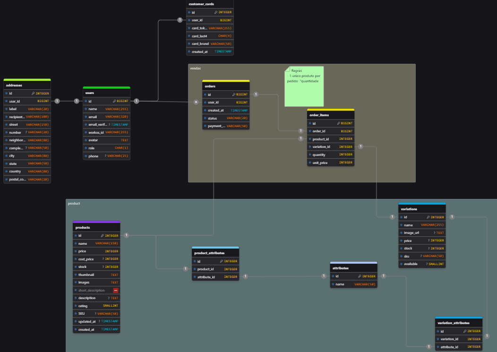
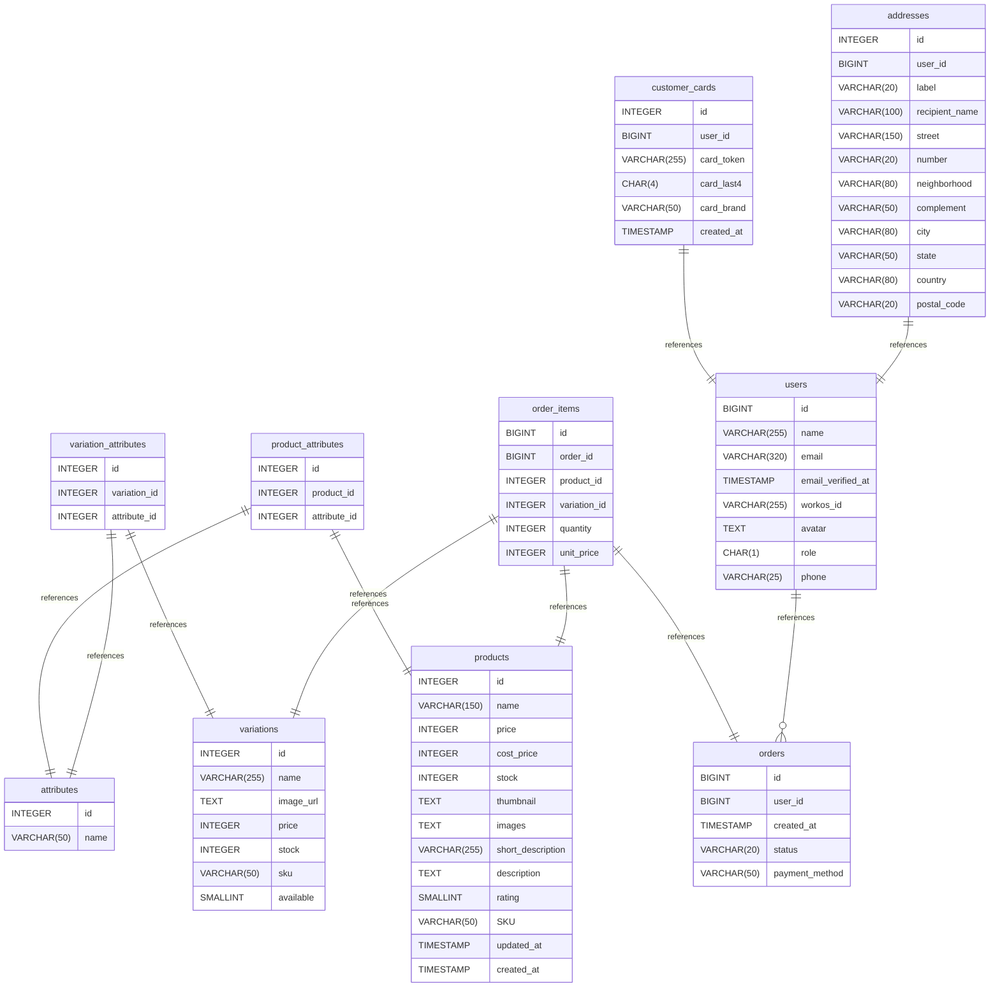

# Diagrama de Entidade Relacionamento  

[Ver no DrawDB](https://www.drawdb.app/editor?shareId=77b2549df4fc14594615fc9ca2adaca2)

Este projeto foi estruturado com um banco de dados relacional, utilizando o PostgreSQL. Abaixo está o diagrama entidade-relacionamento (ER) que ilustra as principais entidades e seus relacionamentos.

    

Apesar do banco de dados comportar produtos com variação, a ideia inicial desse MVP é de que cada produto seja único, ou seja, não há variações de tamanho ou cor. Cada produto é representado por uma única entrada na tabela `products`, e o relacionamento com as tabelas `orders` e `order_items` permite que cada pedido contenha apenas um item por vez, reforçando a ideia de exclusividade e raridade dos produtos oferecidos. No futuro o sistema poderá ser expandido para suportar variações de produtos sem grandes mudanças na estrutura do banco de dados, mantendo a flexibilidade e escalabilidade da aplicação.

## Summary

- [Diagrama de Entidade Relacionamento](#diagrama-de-entidade-relacionamento)
	- [Summary](#summary)
	- [Database type](#database-type)
	- [Table structure](#table-structure)
		- [users](#users)
		- [products](#products)
			- [Indexes](#indexes)
		- [product\_attributes](#product_attributes)
		- [attributes](#attributes)
		- [variation\_attributes](#variation_attributes)
		- [variations](#variations)
		- [orders](#orders)
		- [order\_items](#order_items)
		- [customer\_cards](#customer_cards)
		- [addresses](#addresses)
	- [Relationships](#relationships)
	- [Database Diagram](#database-diagram)

## Database type

- **Database system:** PostgreSQL
  
## Table structure

### users

| Name                  | Type         | Settings                              | References         | Note                                                               |
| --------------------- | ------------ | ------------------------------------- | ------------------ | ------------------------------------------------------------------ |
| **id**                | BIGINT       | 🔑 PK, not null, unique, autoincrement | fk_users_id_orders |                                                                    |
| **name**              | VARCHAR(255) | not null                              |                    |                                                                    |
| **email**             | VARCHAR(320) | not null, unique                      |                    |                                                                    |
| **email_verified_at** | TIMESTAMP    | null                                  |                    |                                                                    |
| **workos_id**         | VARCHAR(255) | not null, unique                      |                    | ID do workOS                                                       |
| **avatar**            | TEXT         | not null                              |                    |                                                                    |
| **role**              | CHAR(1)      | not null, default: c                  |                    | Valores disponíveis "c" para clientes ou "a" para administradores. |
| **phone**             | VARCHAR(25)  | null                                  |                    |                                                                    |

### products

| Name                  | Type         | Settings                              | References | Note                                                                                                                                    |
| --------------------- | ------------ | ------------------------------------- | ---------- | --------------------------------------------------------------------------------------------------------------------------------------- |
| **id**                | INTEGER      | 🔑 PK, not null, unique, autoincrement |            |                                                                                                                                         |
| **name**              | VARCHAR(150) | not null, unique                      |            |                                                                                                                                         |
| **price**             | INTEGER      | not null                              |            | Registrado em centavos para evitar problemas de float point.                                                                            |
| **cost_price**        | INTEGER      | null                                  |            | Registrado em centavos para evitar problemas de float point.                                                                            |
| **stock**             | INTEGER      | null                                  |            | Stock vai existir se o produto não tiver variação, quando tem a variação, o estoque é considerado de acordo com a variação selecionada. |
| **thumbnail**         | TEXT         | not null                              |            |                                                                                                                                         |
| **images**            | TEXT         | not null                              |            | Armazena um array de imagens de produtos                                                                                                |
| **short_description** | VARCHAR(255) | not null                              |            |                                                                                                                                         |
| **description**       | TEXT         | null                                  |            |                                                                                                                                         |
| **rating**            | SMALLINT     | not null, default: 0                  |            | Avaliação de 0 a 5                                                                                                                      |
| **SKU**               | VARCHAR(50)  | null                                  |            |                                                                                                                                         |
| **updated_at**        | TIMESTAMP    | null                                  |            |                                                                                                                                         |
| **created_at**        | TIMESTAMP    | not null                              |            |                                                                                                                                         |

#### Indexes
| Name             | Unique | Fields |
| ---------------- | ------ | ------ |
| products_index_0 |        | name   |
### product_attributes
Vinculo entre atributos e produtos
| Name             | Type    | Settings                              | References                                    | Note |
| ---------------- | ------- | ------------------------------------- | --------------------------------------------- | ---- |
| **id**           | INTEGER | 🔑 PK, not null, unique, autoincrement |                                               |      |
| **product_id**   | INTEGER | not null                              | fk_product_attributes_product_id_products     |      |
| **attribute_id** | INTEGER | not null                              | fk_product_attributes_attribute_id_attributes |      |

### attributes

| Name     | Type        | Settings                              | References | Note |
| -------- | ----------- | ------------------------------------- | ---------- | ---- |
| **id**   | INTEGER     | 🔑 PK, not null, unique, autoincrement |            |      |
| **name** | VARCHAR(50) | not null                              |            |      |

### variation_attributes
Tabela de relação entre um atributo e uma variação
| Name             | Type    | Settings                              | References                                      | Note |
| ---------------- | ------- | ------------------------------------- | ----------------------------------------------- | ---- |
| **id**           | INTEGER | 🔑 PK, not null, unique, autoincrement |                                                 |      |
| **variation_id** | INTEGER | not null                              | fk_variation_attributes_variation_id_variations |      |
| **attribute_id** | INTEGER | not null                              | fk_variation_attributes_attribute_id_attributes |      |

### variations

| Name          | Type         | Settings                              | References | Note                                                       |
| ------------- | ------------ | ------------------------------------- | ---------- | ---------------------------------------------------------- |
| **id**        | INTEGER      | 🔑 PK, not null, unique, autoincrement |            |                                                            |
| **name**      | VARCHAR(255) | not null                              |            |                                                            |
| **image_url** | TEXT         | null                                  |            |                                                            |
| **price**     | INTEGER      | null                                  |            |                                                            |
| **stock**     | INTEGER      | null                                  |            |                                                            |
| **sku**       | VARCHAR(50)  | null                                  |            |                                                            |
| **available** | SMALLINT     | null, default: 0                      |            | O campo de disponibilidade é usado para produtos virtuais. |

### orders

| Name               | Type        | Settings                              | References | Note                                                                                            |
| ------------------ | ----------- | ------------------------------------- | ---------- | ----------------------------------------------------------------------------------------------- |
| **id**             | BIGINT      | 🔑 PK, not null, unique, autoincrement |            |                                                                                                 |
| **user_id**        | BIGINT      | not null                              |            |                                                                                                 |
| **created_at**     | TIMESTAMP   | not null                              |            |                                                                                                 |
| **status**         | VARCHAR(20) | not null, default: pending            |            | `pending`, `processing`, `shipped` , `delivered`, `cancelled`, `refunded`, `failed`, `on_hold`, |
| `completed`        |
| **payment_method** | VARCHAR(50) | not null                              |            |                                                                                                 |

### order_items

| Name             | Type    | Settings                              | References                             | Note |
| ---------------- | ------- | ------------------------------------- | -------------------------------------- | ---- |
| **id**           | BIGINT  | 🔑 PK, not null, unique, autoincrement |                                        |      |
| **order_id**     | BIGINT  | not null                              | fk_order_items_order_id_orders         |      |
| **product_id**   | INTEGER | not null                              | fk_order_items_product_id_products     |      |
| **variation_id** | INTEGER | not null                              | fk_order_items_variation_id_variations |      |
| **quantity**     | INTEGER | not null                              |                                        |      |
| **unit_price**   | INTEGER | not null                              |                                        |      |

### customer_cards

| Name           | Type         | Settings                              | References                      | Note |
| -------------- | ------------ | ------------------------------------- | ------------------------------- | ---- |
| **id**         | INTEGER      | 🔑 PK, not null, unique, autoincrement |                                 |      |
| **user_id**    | BIGINT       | not null                              | fk_customer_cards_user_id_users |      |
| **card_token** | VARCHAR(255) | not null                              |                                 |      |
| **card_last4** | CHAR(4)      | not null                              |                                 |      |
| **card_brand** | VARCHAR(50)  | not null                              |                                 |      |
| **created_at** | TIMESTAMP    | not null                              |                                 |      |

### addresses

| Name               | Type         | Settings                              | References               | Note                   |
| ------------------ | ------------ | ------------------------------------- | ------------------------ | ---------------------- |
| **id**             | INTEGER      | 🔑 PK, not null, unique, autoincrement |                          |                        |
| **user_id**        | BIGINT       | not null                              | fk_address_user_id_users |                        |
| **label**          | VARCHAR(20)  | not null                              |                          | Ex: "Casa", "Trabalho" |
| **recipient_name** | VARCHAR(100) | not null                              |                          |                        |
| **street**         | VARCHAR(150) | not null                              |                          |                        |
| **number**         | VARCHAR(20)  | null                                  |                          |                        |
| **neighborhood**   | VARCHAR(80)  | not null                              |                          |                        |
| **complement**     | VARCHAR(50)  | null                                  |                          |                        |
| **city**           | VARCHAR(80)  | not null                              |                          |                        |
| **state**          | VARCHAR(50)  | not null                              |                          |                        |
| **country**        | VARCHAR(80)  | not null                              |                          |                        |
| **postal_code**    | VARCHAR(20)  | not null                              |                          |                        |

## Relationships

- **product_attributes to products**: one_to_one
- **product_attributes to attributes**: one_to_one
- **variation_attributes to attributes**: one_to_one
- **variation_attributes to variations**: one_to_one
- **order_items to orders**: one_to_one
- **order_items to products**: one_to_one
- **order_items to variations**: one_to_one
- **customer_cards to users**: one_to_one
- **addresses to users**: one_to_one
- **users to orders**: one_to_many

## Database Diagram

