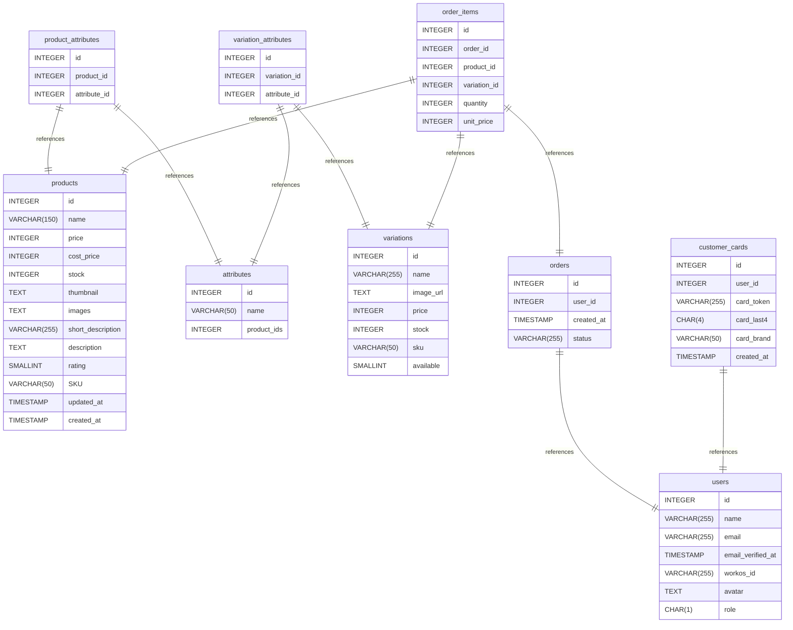

# Diagrama de Entidade Relacionamento  <Badge type="warning" text="em andamento" />

[Ver no DrawDB](https://www.drawdb.app/editor?shareId=77b2549df4fc14594615fc9ca2adaca2)

## Summary

- [Diagrama de Entidade Relacionamento  ](#diagrama-de-entidade-relacionamento--)
  - [Summary](#summary)
  - [Database type](#database-type)
  - [Table structure](#table-structure)
    - [users](#users)
    - [products](#products)
      - [Indexes](#indexes)
    - [product\_attributes](#product_attributes)
    - [attributes](#attributes)
    - [variation\_attributes](#variation_attributes)
    - [variations](#variations)
    - [orders](#orders)
    - [order\_items](#order_items)
    - [customer\_cards](#customer_cards)
  - [Relationships](#relationships)

## Database type

- **Database system:** PostgreSQL
## Table structure

### users

| Name                  | Type         | Settings                              | References | Note                                                               |
| --------------------- | ------------ | ------------------------------------- | ---------- | ------------------------------------------------------------------ |
| **id**                | INTEGER      | 🔑 PK, not null, unique, autoincrement |            |                                                                    |
| **name**              | VARCHAR(255) | not null                              |            |                                                                    |
| **email**             | VARCHAR(255) | not null, unique                      |            |                                                                    |
| **email_verified_at** | TIMESTAMP    | null                                  |            |                                                                    |
| **workos_id**         | VARCHAR(255) | not null, unique                      |            |                                                                    |
| **avatar**            | TEXT         | not null                              |            |                                                                    |
| **role**              | CHAR(1)      | not null, default: c                  |            | Valores disponíveis "c" para clientes ou "a" para administradores. |

### products

| Name                  | Type         | Settings                              | References | Note                                                                                                                                    |
| --------------------- | ------------ | ------------------------------------- | ---------- | --------------------------------------------------------------------------------------------------------------------------------------- |
| **id**                | INTEGER      | 🔑 PK, not null, unique, autoincrement |            |                                                                                                                                         |
| **name**              | VARCHAR(150) | not null, unique                      |            |                                                                                                                                         |
| **price**             | INTEGER      | not null                              |            | Registrado em centavos para evitar problemas de float point.                                                                            |
| **cost_price**        | INTEGER      | null                                  |            | Registrado em centavos para evitar problemas de float point.                                                                            |
| **stock**             | INTEGER      | null                                  |            | Stock vai existir se o produto não tiver variação, quando tem a variação, o estoque é considerado de acordo com a variação selecionada. |
| **thumbnail**         | TEXT         | not null                              |            |                                                                                                                                         |
| **images**            | TEXT         | not null                              |            | Armazena um array de imagens de produtos                                                                                                |
| **short_description** | VARCHAR(255) | not null                              |            |                                                                                                                                         |
| **description**       | TEXT         | null                                  |            |                                                                                                                                         |
| **rating**            | SMALLINT     | not null, default: 0                  |            | Avaliação de 0 a 5                                                                                                                      |
| **SKU**               | VARCHAR(50)  | null                                  |            |                                                                                                                                         |
| **updated_at**        | TIMESTAMP    | null                                  |            |                                                                                                                                         |
| **created_at**        | TIMESTAMP    | not null                              |            |                                                                                                                                         |

#### Indexes
| Name             | Unique | Fields |
| ---------------- | ------ | ------ |
| products_index_0 |        | name   |
### product_attributes
Vinculo entre atributos e produtos
| Name             | Type    | Settings                              | References                                    | Note |
| ---------------- | ------- | ------------------------------------- | --------------------------------------------- | ---- |
| **id**           | INTEGER | 🔑 PK, not null, unique, autoincrement |                                               |      |
| **product_id**   | INTEGER | not null                              | fk_product_attributes_product_id_products     |      |
| **attribute_id** | INTEGER | not null                              | fk_product_attributes_attribute_id_attributes |      |

### attributes

| Name            | Type        | Settings                              | References | Note |
| --------------- | ----------- | ------------------------------------- | ---------- | ---- |
| **id**          | INTEGER     | 🔑 PK, not null, unique, autoincrement |            |      |
| **name**        | VARCHAR(50) | not null                              |            |      |
| **product_ids** | INTEGER     | null                                  |            |      |

### variation_attributes

| Name             | Type    | Settings                              | References                                      | Note |
| ---------------- | ------- | ------------------------------------- | ----------------------------------------------- | ---- |
| **id**           | INTEGER | 🔑 PK, not null, unique, autoincrement |                                                 |      |
| **variation_id** | INTEGER | not null                              | fk_variation_attributes_variation_id_variations |      |
| **attribute_id** | INTEGER | not null                              | fk_variation_attributes_attribute_id_attributes |      |

### variations

| Name          | Type         | Settings                              | References | Note                                                       |
| ------------- | ------------ | ------------------------------------- | ---------- | ---------------------------------------------------------- |
| **id**        | INTEGER      | 🔑 PK, not null, unique, autoincrement |            |                                                            |
| **name**      | VARCHAR(255) | not null                              |            |                                                            |
| **image_url** | TEXT         | null                                  |            |                                                            |
| **price**     | INTEGER      | null                                  |            |                                                            |
| **stock**     | INTEGER      | null                                  |            |                                                            |
| **sku**       | VARCHAR(50)  | null                                  |            |                                                            |
| **available** | SMALLINT     | not null, default: 0                  |            | O campo de disponibilidade é usado para produtos virtuais. |

### orders

| Name           | Type         | Settings                              | References              | Note |
| -------------- | ------------ | ------------------------------------- | ----------------------- | ---- |
| **id**         | INTEGER      | 🔑 PK, not null, unique, autoincrement |                         |      |
| **user_id**    | INTEGER      | not null                              | fk_orders_user_id_users |      |
| **created_at** | TIMESTAMP    | not null                              |                         |      |
| **status**     | VARCHAR(255) | not null, default: pending            |                         |      |

### order_items

| Name             | Type    | Settings                              | References                             | Note |
| ---------------- | ------- | ------------------------------------- | -------------------------------------- | ---- |
| **id**           | INTEGER | 🔑 PK, not null, unique, autoincrement |                                        |      |
| **order_id**     | INTEGER | not null                              | fk_order_items_order_id_orders         |      |
| **product_id**   | INTEGER | not null                              | fk_order_items_product_id_products     |      |
| **variation_id** | INTEGER | not null                              | fk_order_items_variation_id_variations |      |
| **quantity**     | INTEGER | not null                              |                                        |      |
| **unit_price**   | INTEGER | not null                              |                                        |      |

### customer_cards

| Name           | Type         | Settings                              | References                      | Note |
| -------------- | ------------ | ------------------------------------- | ------------------------------- | ---- |
| **id**         | INTEGER      | 🔑 PK, not null, unique, autoincrement |                                 |      |
| **user_id**    | INTEGER      | not null                              | fk_customer_cards_user_id_users |      |
| **card_token** | VARCHAR(255) | not null                              |                                 |      |
| **card_last4** | CHAR(4)      | not null                              |                                 |      |
| **card_brand** | VARCHAR(50)  | not null                              |                                 |      |
| **created_at** | TIMESTAMP    | not null                              |                                 |      |

## Relationships

- **product_attributes to products**: one_to_one
- **product_attributes to attributes**: one_to_one
- **variation_attributes to attributes**: one_to_one
- **variation_attributes to variations**: one_to_one
- **orders to users**: one_to_one
- **order_items to orders**: one_to_one
- **order_items to products**: one_to_one
- **order_items to variations**: one_to_one
- **customer_cards to users**: one_to_one

