# 🖼️ Pages of app

Abaixo estão algumas telas que demonstram o fluxo da aplicação.

### Página de Produtos

#### Usuário Não logado com Tema dark

    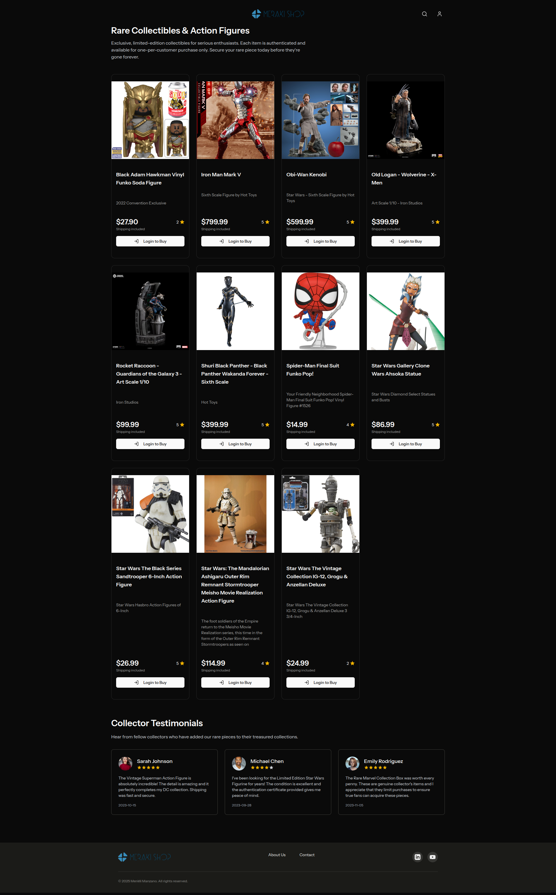

#### Usuário Logado com Tema light 

    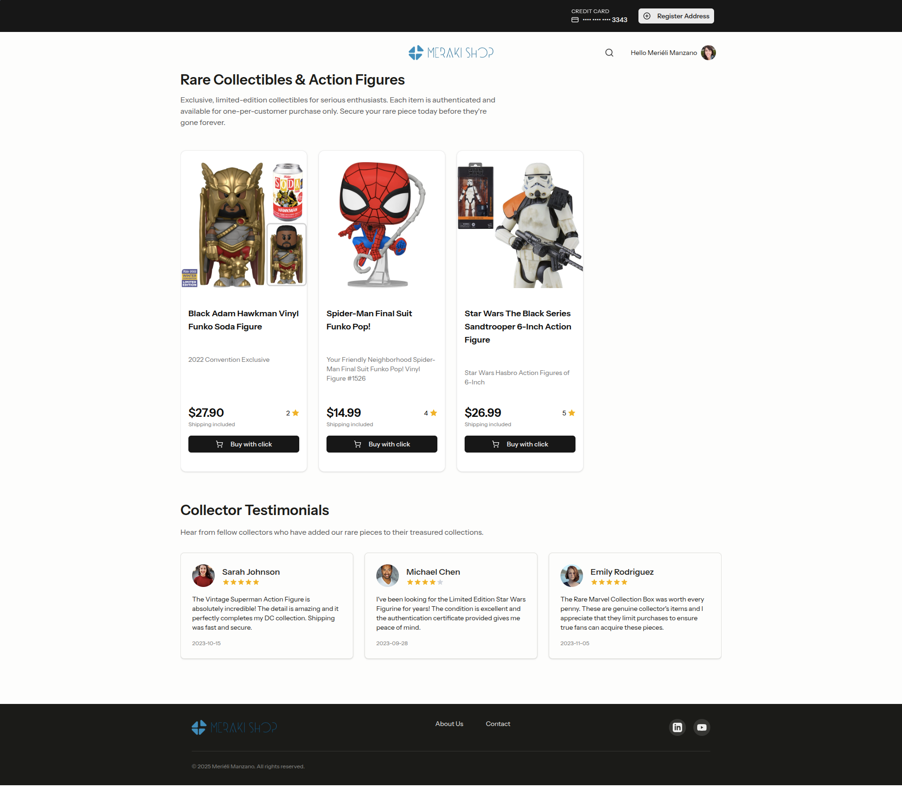

> Nessa tela o usuário havia cadastrado apenas o cartão de crédito, por isso há um botão no topo para registro do endereço.

### Página de Login

    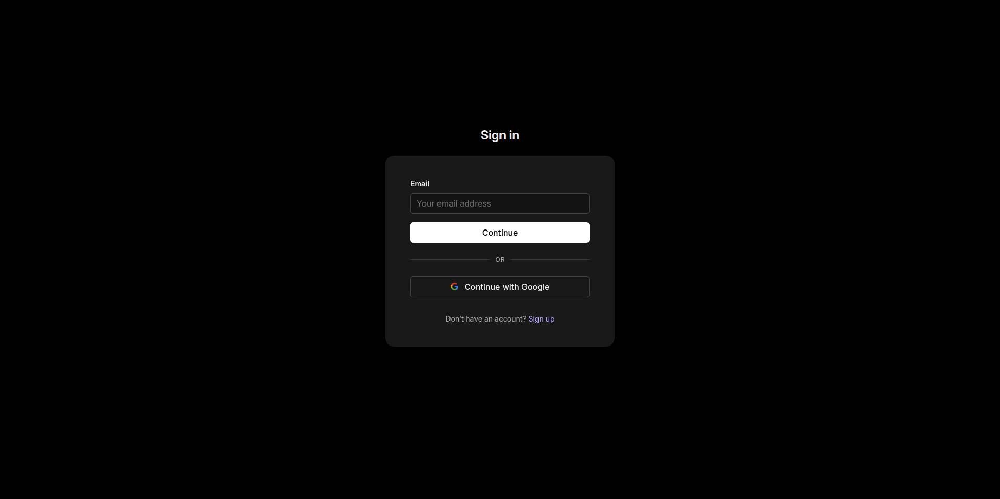

### Páginas do painel Administrativo

#### Meus pedidos

    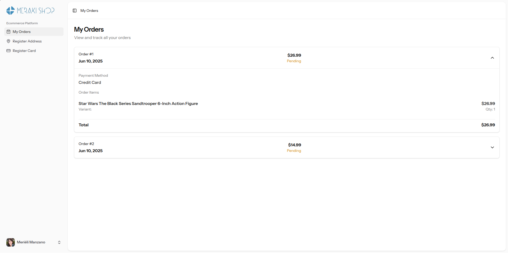

> Esta imagem é a visualização de um usuário comum no sistema para o seu histórico de pedidos.
> 
> Quando o usuário for do tipo cliente, ele verá algumas opções limitadas no sistema, disponíveis apenas para o controle e gerenciamento das suas compras na loja.

    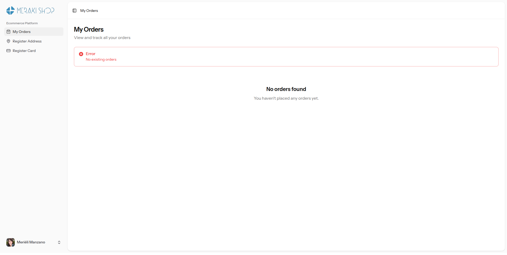

> Página sem pedidos

#### Painel administrativo visualização de administrador

    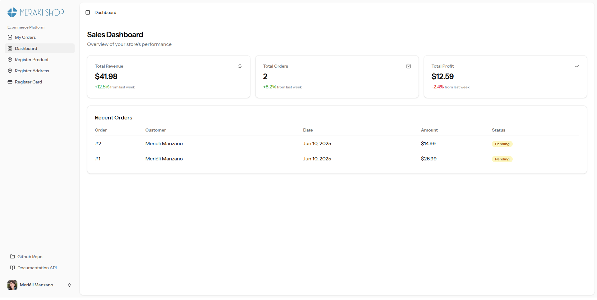

> O administrador é o usuário que controla os produtos do ecommerce, por isso pode ver os além das funcionalidades comuns, o registro de produtos e o Dashboard, com métricas de vendas e os pedidos mais recentes realizados pelos clientes.

#### Cadastro de Produto

    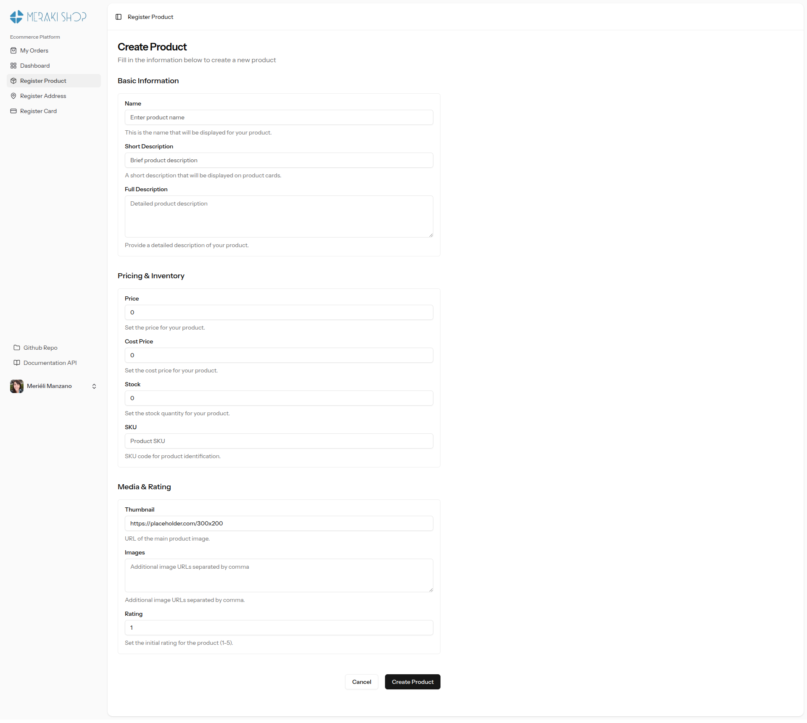

#### Cadastro de endereço

    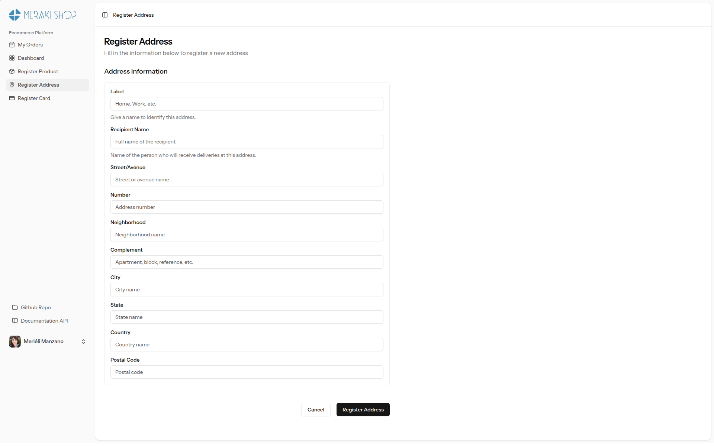

#### Cadastro de cartão de crédito

    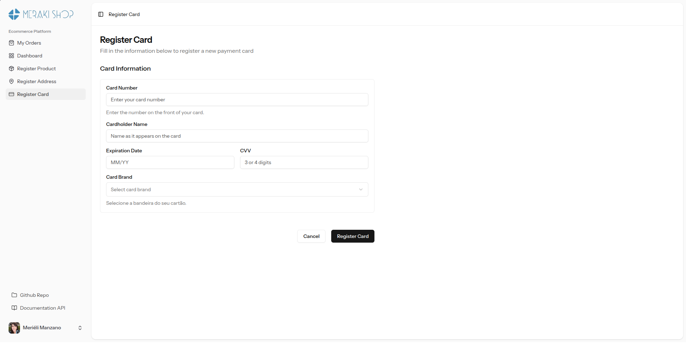

#### Configurações de conta

    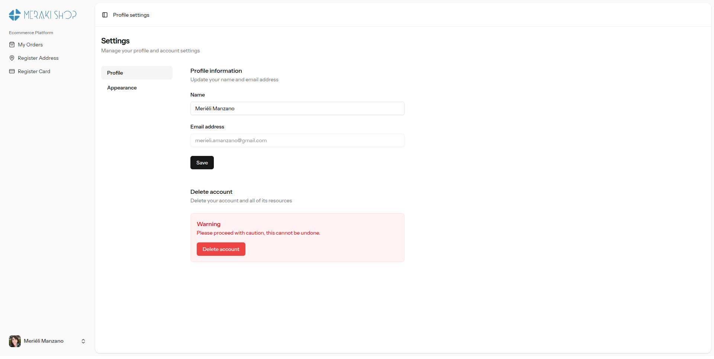

#### Configurações de Aparência da loja

    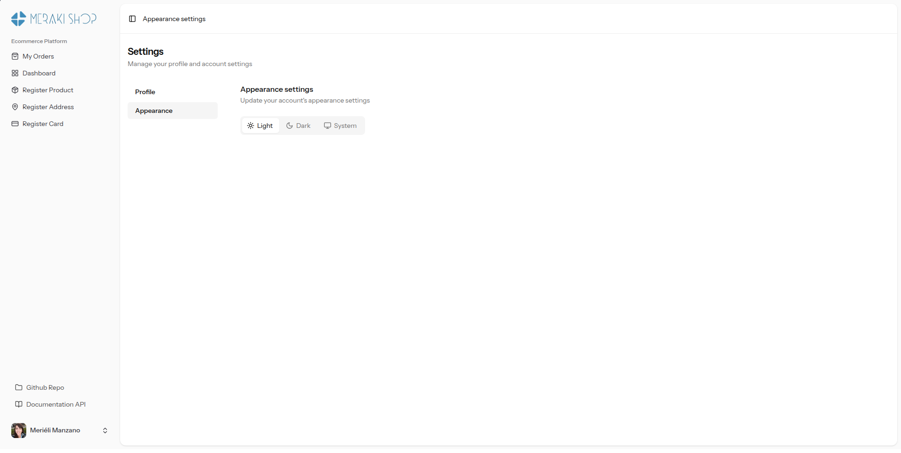

#### Registro de cartão de crédito com sucesso 

    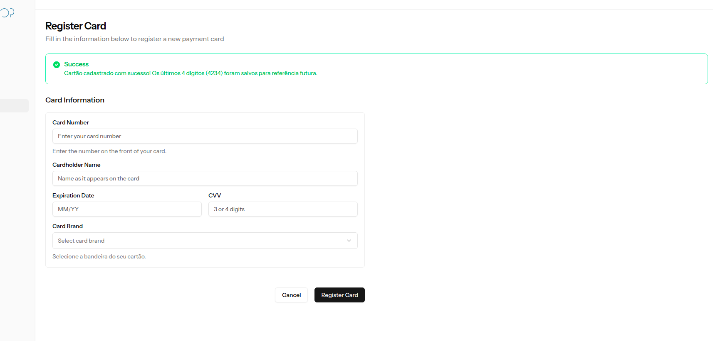

#### Tentativa de compra do produto 

    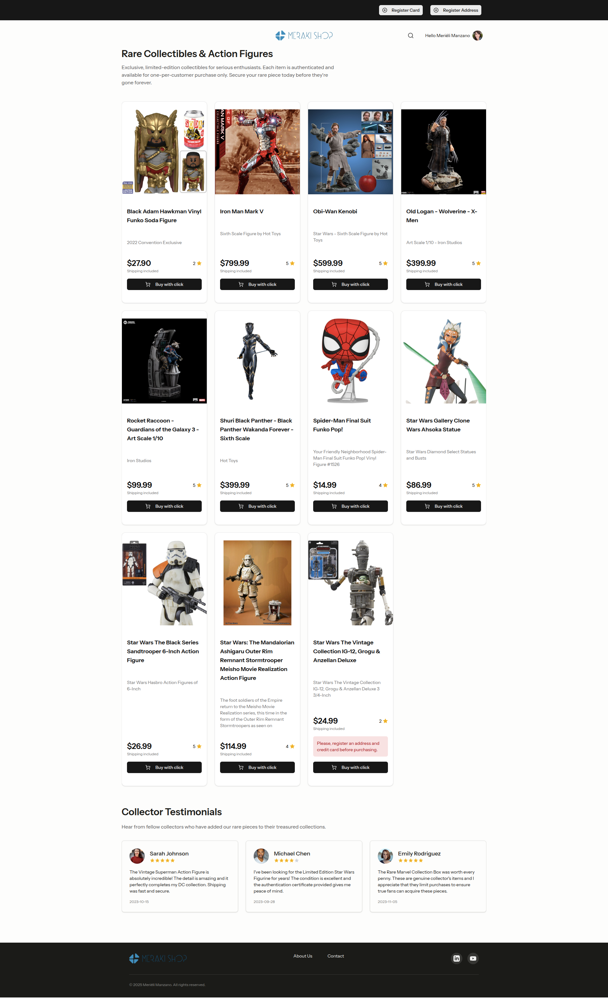

> Erro que é exibido ao tentar comprar sem um endereço e cartão de crédito cadastrados

    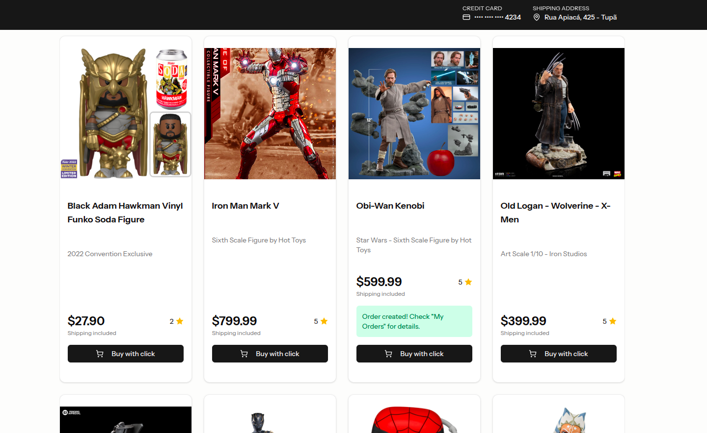

> Compra do produto com sucesso quando todos os dados estão corretos
