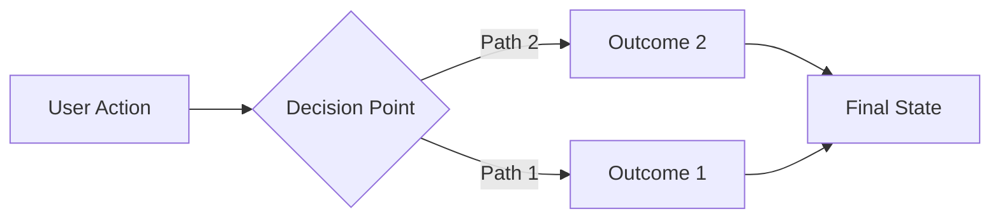
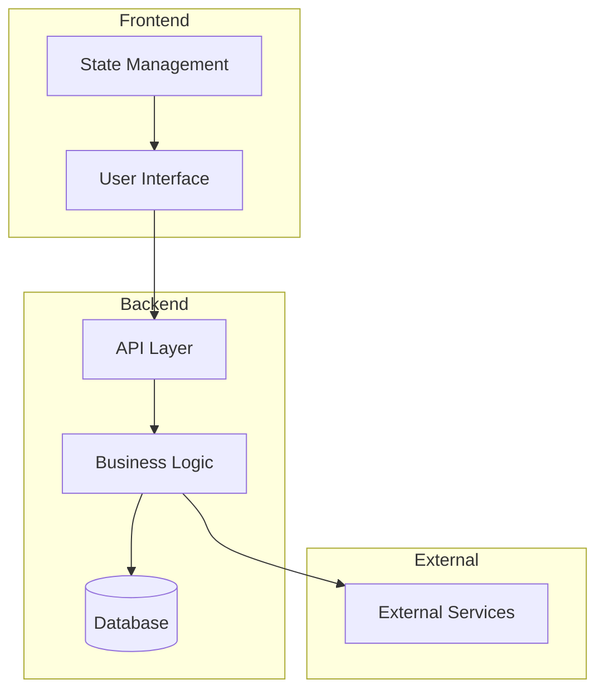
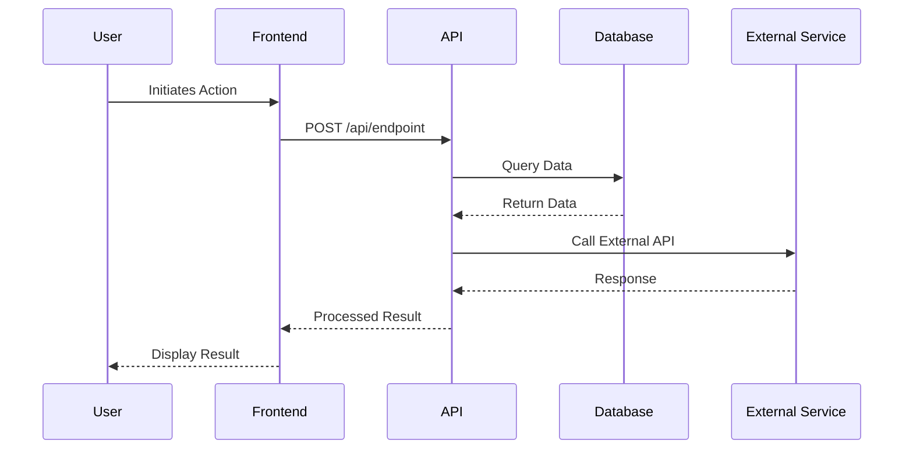
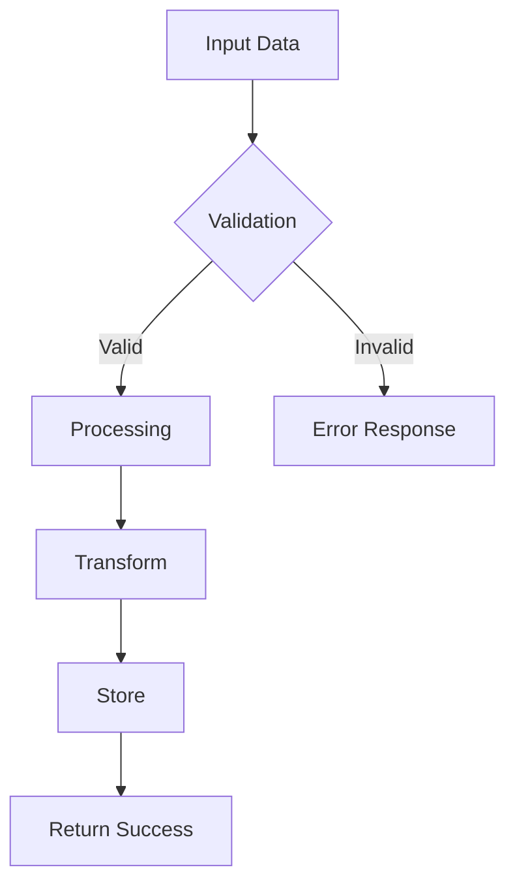
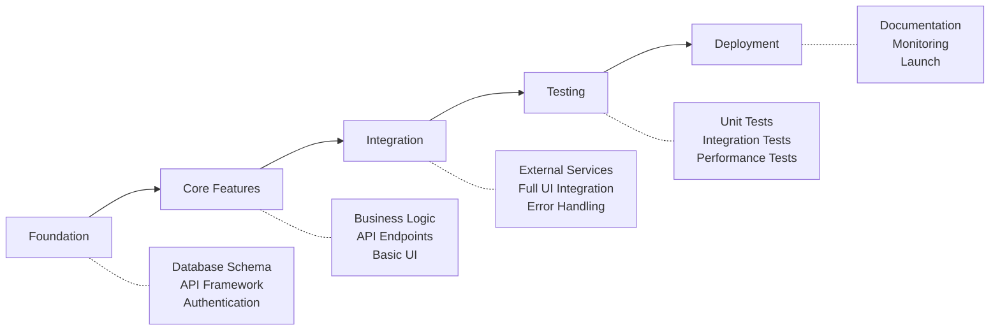

<contexto>

# Visão Geral  

O Meraki Shop elimina a frustração de colecionadores que perdem itens raros devido a checkouts lentos, oferecendo a funcionalidade "compra com 1 clique" para aquisições rápidas. É destinado  a colecionadores de figuras de ação, entusiastas de cultura pop e fãs de edições limitadas que buscam agilidade e exclusividade. Proporciona uma experiência de compra rápida, intuitiva e confiável aumentando as chances de adquirir itens raros e exclusivos.

# Funcionalidades Principais  

- **Autenticação Segura**: permite registro e login de usuários via Google (WorkOS), exigindo cadastro de endereço de entrega e cartão de crédito. Dessa forma, garante segurança nos acessos e agiliza compras ao armazenar dados essenciais. Usuários autenticam-se via Google, e em seguida preenchem e salvam informações de entrega e pagamento no perfil.
- **Catálogo de Produtos**: exibe produtos colecionáveis de figuras de ação com fotos, preço, descrições detalhadas e o botão de compra. Dessa forma, permite que os usuários encontrem rapidamente itens de interesse. Produtos são listados em uma interface simplificada, com os produtos exibidos em grade. 
- **Compra com 1 Clique**: permite compra instantânea usando dados salvos, com confirmação imediata. Dessa forma, reduz o tempo de checkout, aumentando chances de adquirir itens raros. Usuários logados clicam no botão de compra, que processa automaticamente o pagamento e entrega.
- **Painel do Cliente**: oferece histórico de compras, gerenciamento de endereços, cartões e status de pedidos. Dessa forma, permite controle e transparência ao cliente sobre suas transações. O painel possui interface acessível e exibe e permite edição de dados e acompanhamento de pedidos.
- **Painel Administrativo**: gerencia produtos (CRUD), pedidos, usuários e exibe métricas de vendas.Permite controle eficiente da loja e análise de desempenho. Administradores acessam uma interface para adicionar/editar produtos, gerenciar pedidos e visualizar relatórios.


# Experiência do Usuário  
<!-- [Descreva a jornada e a experiência do usuário. Inclua:
- Personas de usuário
- Fluxos de uso principais
- Considerações de UI/UX] -->

Exemplo:


</contexto>
<PRD>

# Arquitetura Técnica  
<!-- [Descreva os detalhes de implementação técnica:
- Componentes do sistema
- Modelos de dados
- APIs e integrações
- Requisitos de infraestrutura
- Formato de resposta esperado] -->

## High-Level Architecture



## Component Breakdown

- **Frontend Components**:
  - [Component 1]: [Purpose]
  - [Component 2]: [Purpose]

- **Backend Services**:
  - [Service 1]: [Purpose]
  - [Service 2]: [Purpose]

- **Data Models**:
  - [Model 1]: [Fields and relationships]
  - [Model 2]: [Fields and relationships]

## API Design




### Endpoints

- **POST /api/[resource]**
  - Request: `{field1: type, field2: type}`
  - Response: `{status: string, data: {...}}`
  - Errors: `400 Bad Request`, `401 Unauthorized`

## Data Flow



# Roadmap de Desenvolvimento  
<!-- [Divida o processo de desenvolvimento em fases:
- Requisitos do MVP
- Melhorias futuras
- Não pense em prazos neste momento — o que importa é o escopo e detalhar exatamente o que precisa ser construído em cada fase para depois ser quebrado em tarefas] -->


## Development Phases




## Definition of Done
- [ ] All user stories implemented
- [ ] Test coverage > 80%
- [ ] Performance benchmarks met
- [ ] Security review passed
- [ ] Documentation complete

## Measurable Outcomes
- Metric 1: [Target value]
- Metric 2: [Target value]
- User satisfaction: [Target score]

# Cadeia Lógica de Dependências  
<!-- [Defina a ordem lógica de desenvolvimento:
- Quais funcionalidades precisam ser construídas primeiro (fundação)
- Chegar o mais rápido possível em algo utilizável/visível no front-end que funcione
- Planejar e dimensionar corretamente cada funcionalidade para que seja atômica, mas que também possa ser expandida e melhorada conforme o desenvolvimento avança] -->

## Implementation Priority
1. **Foundation**: Core infrastructure and setup
2. **MVP Features**: Minimum viable functionality
3. **Enhanced Features**: Additional capabilities
4. **Polish**: Performance, UX improvements
5. **Production Ready**: Full testing and deployment


# Riscos e Mitigações  
<!-- [Identifique riscos potenciais e como serão tratados:
- Desafios técnicos
- Definição do MVP que possa ser evoluído
- Restrições de recursos] -->


#### Devil's Advocate Analysis
```yaml
challenges:
  technical_risks:
    - risk: "Performance at scale"
      mitigation: "Implement caching layer"
    
    - risk: "Third-party API reliability"
      mitigation: "Build fallback mechanisms"
  
  business_risks:
    - risk: "User adoption"
      mitigation: "Phased rollout with feedback loops"
    
    - risk: "Scope creep"
      mitigation: "Strict MVP definition"
  
  edge_cases:
    - scenario: "No network connectivity"
      handling: "Offline mode with sync"
    
    - scenario: "Concurrent updates"
      handling: "Optimistic locking"
```


# Apêndice  
<!-- [Inclua quaisquer informações adicionais:
- Descobertas de pesquisa
- Especificações técnicas] -->

## MUST READ - Include these in your context window
- url: https://ai.pydantic.dev/agents/
  why: Core agent creation patterns
  
- url: https://ai.pydantic.dev/multi-agent-applications/
  why: Multi-agent system patterns, especially agent-as-tool
  
- url: https://developers.google.com/gmail/api/guides/sending
  why: Gmail API authentication and draft creation
  
- url: https://api-dashboard.search.brave.com/app/documentation
  why: Brave Search API REST endpoints
  
- file: examples/agent/agent.py
  why: Pattern for agent creation, tool registration, dependencies
  
- file: examples/agent/providers.py
  why: Multi-provider LLM configuration pattern
  
- file: examples/cli.py
  why: CLI structure with streaming responses and tool visibility

- url: https://github.com/googleworkspace/python-samples/blob/main/gmail/snippet/send%20mail/create_draft.py
  why: Official Gmail draft creation example

</PRD>
