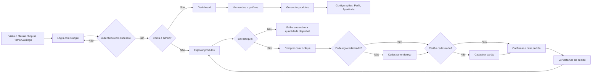
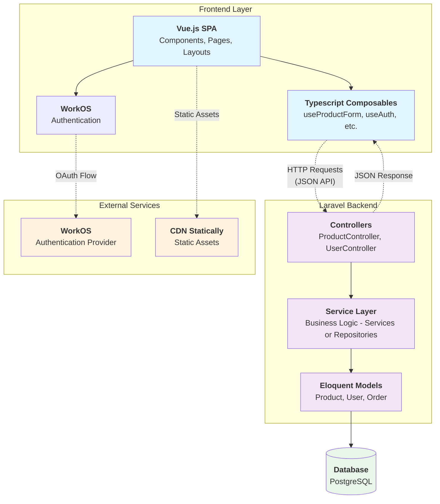
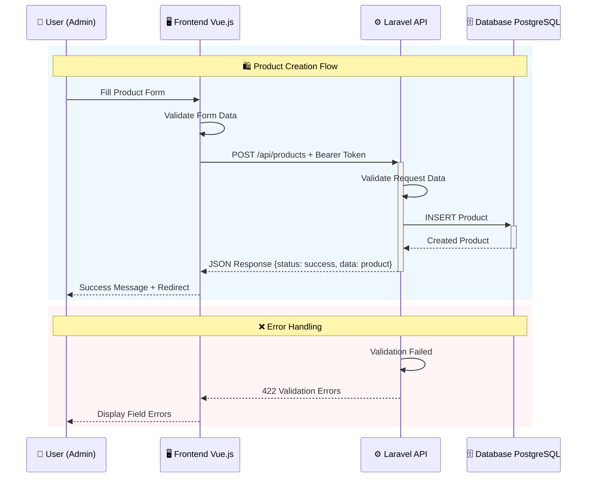
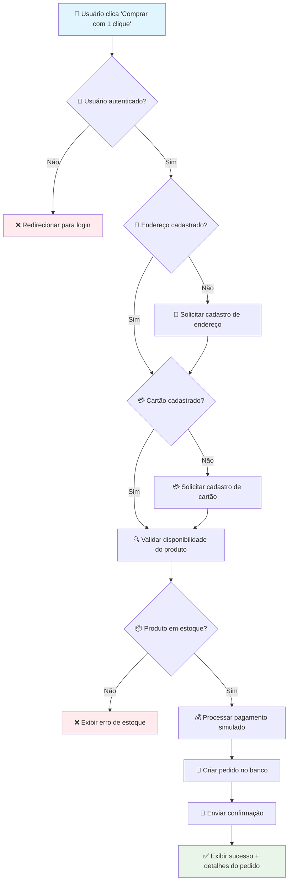

<contexto>

# Visão Geral  

O Meraki Shop elimina a frustração de colecionadores que perdem itens raros devido a checkouts lentos, oferecendo a funcionalidade "compra com 1 clique" para aquisições rápidas. É destinado  a colecionadores de figuras de ação, entusiastas de cultura pop e fãs de edições limitadas que buscam agilidade e exclusividade. Proporciona uma experiência de compra rápida, intuitiva e confiável aumentando as chances de adquirir itens raros e exclusivos.

# Funcionalidades Principais  

- **Autenticação Segura**: permite registro e login de usuários via Google (WorkOS), exigindo cadastro de endereço de entrega e cartão de crédito. Dessa forma, garante segurança nos acessos e agiliza compras ao armazenar dados essenciais. Usuários autenticam-se via Google, e em seguida preenchem e salvam informações de entrega e pagamento no perfil.
- **Catálogo de Produtos**: exibe produtos colecionáveis de figuras de ação com fotos, preço, descrições detalhadas e o botão de compra. Dessa forma, permite que os usuários encontrem rapidamente itens de interesse. Produtos são listados em uma interface simplificada, com os produtos exibidos em grade. 
- **Compra com 1 Clique**: permite compra instantânea usando dados salvos, com confirmação imediata. Dessa forma, reduz o tempo de checkout, aumentando chances de adquirir itens raros. Usuários logados clicam no botão de compra, que processa automaticamente o pagamento e entrega.
- **Painel do Cliente**: oferece histórico de compras, gerenciamento de endereços, cartões e status de pedidos. Dessa forma, permite controle e transparência ao cliente sobre suas transações. O painel possui interface acessível e exibe e permite edição de dados e acompanhamento de pedidos.
- **Painel Administrativo**: gerencia produtos (CRUD), pedidos, usuários e exibe métricas de vendas.Permite controle eficiente da loja e análise de desempenho. Administradores acessam uma interface para adicionar/editar produtos, gerenciar pedidos e visualizar relatórios.


# Experiência do Usuário  
<!-- [Descreva a jornada e a experiência do usuário. Inclua:
- Personas de usuário
- Fluxos de uso principais
- Considerações de UI/UX] -->

## Fluxo principal do usuário



</contexto>
<PRD>

# Arquitetura Técnica  

## High-Level Architecture



## Component Breakdown

- **Frontend Components**:
  - **UserInfo.vue**: Exibe informações do usuário logado com avatar, nome, email e integração com sistema de iniciais quando não há foto.
  - **NavMain.vue**: Menu principal de navegação com controle de permissões (admin/user), ícones dinâmicos e indicação de página ativa.
  - **AppearanceTabs.vue**: Controle de tema da aplicação permitindo alternar entre modo claro, escuro e automático baseado no sistema.
  - **ProductCard.vue:** Card de produto na vitrine com imagem, preço, avaliação, botão de compra e feedback de status de pedidos.
  - **TopBanner.vue:** Banner informativo que exibe status de cartão e endereço cadastrados, com botões para registro quando necessário.

- **Backend Services**:
  - **ProductService.php (Business Logic):** Gerencia a lógica de negócio para produtos, incluindo criação, validação, formatação de dados (preços em centavos), e aplicação de regras de negócio antes da persistência no banco de dados.
  - **ProductRepository.php (Data Access Layer):** Centraliza operações de acesso a dados de produtos, implementando padrão Repository para abstrair consultas complexas e manter separação entre lógica de negócio e acesso a dados.
  - **UserRepository.php (Data Access Layer):** Gerencia operações de persistência de usuários, incluindo consultas específicas para autenticação, perfis administrativos e relacionamentos com pedidos e endereços.
  - **AddressRepository.php (Data Access Layer):** Controla operações CRUD para endereços de entrega, implementando validações específicas e consultas otimizadas para relacionamentos usuário-endereço.
  - **ProductController.php (API Controllers):** API para gerenciamento de produtos com endpoints para CRUD, validação de entrada via FormRequests e retorno de dados formatados em JSON.
  - **OrderController.php, AddressController.php, CustomerCardController.php (API Controllers):**  gerencia operações CRUD, integrando pedidos, endereço e cartões de crédito.
  - **ProductFormRequest.php (Data Validation):** Centraliza regras de validação para dados de produtos, incluindo validação de preços, URLs de imagens, limites de caracteres e campos obrigatórios.

Baseado nas migrations do projeto **Meraki Shop**, aqui estão os principais modelos de dados:

- **Data Models**:
  - **User**: `id`, `name`, `email`, `workos_id`, `avatar`, `role` (admin/client) - Relacionamentos: hasMany(Orders, Addresses, CustomerCards)
  - **Product**: `id`, `name`, `price` (centavos), `cost_price`, `stock`, `thumbnail`, `images`, `short_description`, `description`, `rating`, `sku` - Relacionamentos: hasMany(OrderItems), belongsToMany(Attributes)
  - **Order**: `id`, `user_id`, `status`, `payment_method` - Relacionamentos: belongsTo(User), hasMany(OrderItems)
  - **OrderItem**: `id`, `order_id`, `product_id`, `variation_id`, `quantity`, `unit_price` - Relacionamentos: belongsTo(Order, Product, Variation)
  - **Address**: `id`, `user_id`, `label`, `recipient_name`, `street`, `number`, `neighborhood`, `complement`, `city`, `state`, `country`, `postal_code` - Relacionamentos: belongsTo(User)
  - **CustomerCard**: `id`, `user_id`, `card_token`, `card_last4`, `card_brand` - Relacionamentos: belongsTo(User)
  - **Variation**: `id`, `name`, `image_url`, `price`, `stock`, `sku`, `available` - Relacionamentos: hasMany(OrderItems), belongsToMany(Attributes)
  - **Attribute**: `id`, `name` - Relacionamentos: belongsToMany(Products, Variations)
  - **PersonalAccessToken**: `id`, `tokenable_type`, `tokenable_id`, `name`, `token`, `abilities`, `last_used_at`, `expires_at` - Sistema de autenticação API (Laravel Sanctum)

## API Design




### Principais Endpoints da API

#### Produtos
- **GET /api/products**
  - Obtém todos os produtos com paginação
  - Response: `{data: [products], meta: {pagination}}`

- **GET /api/products/{id}**
  - Obtém um produto específico por ID
  - Response: `{data: product}`

- **POST /api/products** *(Admin only)*
  - Request Body: `{name: string, price: number, cost_price: number, stock: number, thumbnail: string, images: array, short_description: string, description: string, sku: string}`
  - Response: `{status: 'success', data: product}`
  - Errors: `422 Validation Error`, `401 Unauthorized`, `403 Forbidden`

#### Pedidos  
- **POST /api/orders** *(Admin or Authenticated User)*
  - Request: `{product_id: number, quantity: number}`
  - Response: `{status: 'success', data: order, message: 'Pedido criado com sucesso!'}`
  - Errors: `422 Validation Error`, `400 Bad Request` (estoque insuficiente)

- **GET /api/orders** *(Admin or Authenticated User)*
  - Request: Bearer Token
  - Response: `{data: [orders], meta: {pagination}}`
  - Errors: `401 Unauthorized`

#### Usuários e Autenticação 
- **GET /api/users** *(Admin or Authenticated User)*
  - Request: Bearer Token
  - Response: `{data: user_with_addresses_and_cards}`
  - Errors: `401 Unauthorized`

#### Endereços
- **POST /api/address** *(Admin or Authenticated User)*
  - Request: `{label: string, recipient_name: string, street: string, number: string, neighborhood: string, city: string, state: string, country: string, postal_code: string, complement?: string}`
  - Response: `{status: 'success', data: address}`
  - Errors: `422 Validation Error`, `401 Unauthorized`

#### Cartões

- **POST /api/credit-card**
  - Request: `{card_token: string, card_last4: string, card_brand: string}`
  - Response: `{status: 'success', data: card}`
  - Errors: `422 Validation Error`, `401 Unauthorized`

## Data Flow - Compra com 1 Clique



# Roadmap de Desenvolvimento  

### Phases

**Phase 1 - Setup e Autenticação**
- ✅ Configuração Laravel + Vue.js + Inertia
- ✅ Integração com WorkOS para autenticação Google 
- ✅ Schema do banco PostgreSQL com migrations
- ✅ Middleware de autenticação e controle de acesso

**Phase 2 - Gestão de Produtos e Catálogo**
- ✅ Models e API para Produtos
- ✅ Interface administrativa para CRUD de produtos
- ✅ Catálogo público com produtos
- ✅ Upload e gerenciamento de imagens

**Phase 3 - Fluxo de Compra Padrão**
- ✅ Sistema de pedidos
- ✅ Gerenciamento de endereços e cartões
- ✅ Fluxo básico de checkout
- ✅ Histórico de pedidos para usuários

**Phase 4 - Implementação de Compra Rápida**
- ✅ Botão "Comprar com 1 clique"
- ✅ Validação automática de dados salvos
- ✅ Feedback visual imediato

**Phase 5 - Painel Administrativo**
- ✅ Dashboard com métricas de vendas
- ✅ Gestão de pedidos
- ✅ Configurações e preferências

**Phase 6 - Criação de produtos via painel**
- ⏳ Implementação do formulário de criação de produtos
- ⏳ Feedback visual de sucesso/erro
- ⏳ Validação de dados do formulário

**Phase 7 - Filtro de produtos por nome**
- ⏳ Implementação de filtros de produtos
- ⏳ Busca por nome de produto

**Phase 8 - Votação para revisão de produtos**
- ⏳ Implementação de sistema de votação
- ⏳ Feedback visual de votos
- ⏳ Exibição revisões reais dos produtos

**Phase 9 - Testes e Otimizações**
- ⏳ Testes unitários e de integração
- ⏳ Otimização de performance (< 1500ms API)
- ⏳ Revisão de segurança
- ⏳ Deploy em produção

## Definition of Done

- [ ] **Funcionalidades**: 100% das user stories do PRD implementadas
- [ ] **Performance**: Tempo de resposta da API < 1500ms
- [ ] **Segurança**: Zero compras sem autenticação
- [ ] **UX**: Compra com 1 clique funciona sem erros
- [ ] **Feedback**: Retorno visual imediato em todas as ações
- [ ] **Testes**: Coverage > 80% nas funcionalidades críticas
- [ ] **Documentation**: PRD, API docs e README atualizados

## Métricas de Sucesso

- **Performance**: Tempo médio de resposta da API abaixo de 1500ms
- **Funcionalidade**: 100% de cobertura das funcionalidades propostas  
- **Segurança**: Zero compras realizadas sem autenticação
- **UX**: Usuários conseguem realizar compra com 1 clique sem erros
- **Feedback**: Feedback visual imediato nas ações do usuário (compra bem-sucedida, erro de validação)


# Cadeia Lógica de Dependências  

# Riscos e Mitigações  

```yaml
challenges:
  technical_risks:   
    - risk: "WorkOS/Google OAuth indisponível"
      mitigation: "Fallback para manutenção, monitoramento da API externa"
      priority: "MÉDIA"
    
    - risk: "Concorrência na compra de itens raros"
      mitigation: "Transações atômicas, controle de estoque com locks"
      priority: "ALTA"
    
    - risk: "Falha no processamento de pagamento simulado"
      mitigation: "Logs detalhados, rollback de pedidos, retry mechanism"
      priority: "MÉDIA"
  
  edge_cases:
    - scenario: "Produto fora de estoque durante compra 1-click"
      handling: "Validação em tempo real, mensagem clara de indisponibilidade"
      
    - scenario: "Múltiplos cliques simultâneos no botão de compra"
      handling: "Debounce no frontend, idempotência na API"
    
    - scenario: "Usuário sem endereço/cartão tenta compra rápida"
      handling: "Redirect automático para cadastro, manutenção do contexto do produto"
      
    - scenario: "Sessão expirada durante compra"
      handling: "Re-autenticação transparente, preservação do carrinho"

security_considerations:
  - concern: "Dados de cartão armazenados"
    solution: "Apenas tokens e últimos 4 dígitos, nunca dados completos"
    
  - concern: "Compras não autorizadas"
    solution: "Validação rigorosa de token, logs de auditoria"
    
  - concern: "CSRF em compras críticas"
    solution: "CSRF tokens em todas as transações, SameSite cookies"
```


# Apêndice  

- **PRD (Product Requirements Document)**: `.docs/src/requirements/prd.md`
  - Visão completa do produto, funcionalidades e métricas de sucesso
- **Projeto no Figma**: [Meraki Design System](https://www.figma.com/design/qK1ZmNSo1sYd2o9UGNKvKF/MERAKI---Relume-Figma-Kit--v3.0---Community-?node-id=1919-1544&p=f&t=MBcrqmysAoPULprc-0)
  - Design e layouts da aplicação
- **WorkOS Dashboard**: [Environment Setup](https://dashboard.workos.com/environment_01JV7T3ECPE68XY5J73MD05FV4/onboarding/sso)
  - Configuração do Google OAuth integration para autenticação
- **Vue.js 3 Composition API**: [Official Guide](https://vuejs.org/guide/extras/composition-api-faq.html)
  - Padrões utilizados nos composables do projeto
- **Inertia.js**: [Documentation](https://inertiajs.com/)
  - Bridge entre Laravel e Vue.js para SPAs
- **Laravel Eloquent**: [Relationships](https://laravel.com/docs/12.x/eloquent-relationships)
  - Padrões de relacionamento utilizados no projeto através do ORM Eloquent

### 📁 Arquivos de código Referência do Projeto

- **Migrations**: `database/migrations/`
  - Schema completo do banco de dados
- **Models**: `app/Models/`
  - Estrutura de dados e relacionamentos
- **API Controllers**: `app/Http/Controllers/Api/`
  - Endpoints da API implementados
- **Vue Components**: `resources/js/components/`
  - Componentes reutilizáveis do frontend
- **Composables**: `resources/js/composables/`
  - Lógica reativa compartilhada (useAuth, useProductForm, etc.)

</PRD>
