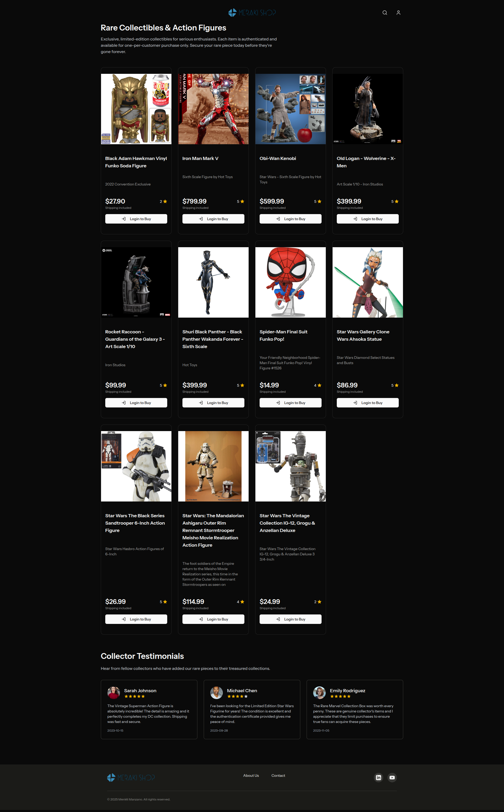
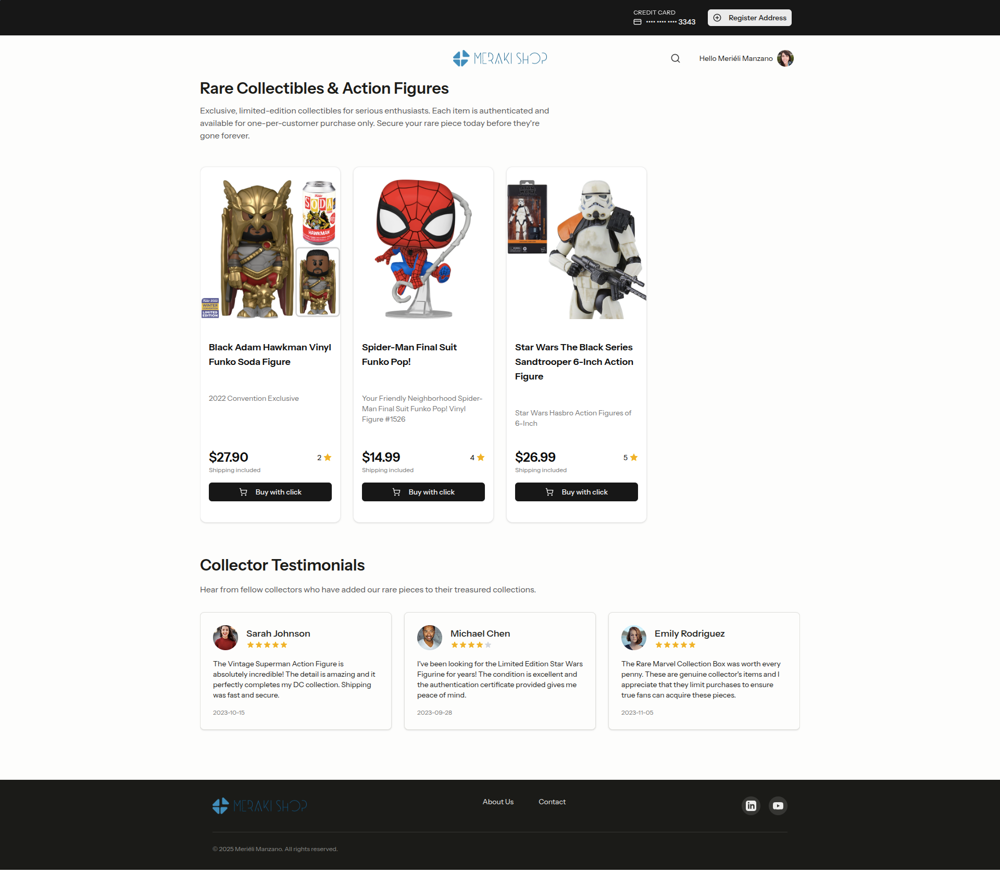
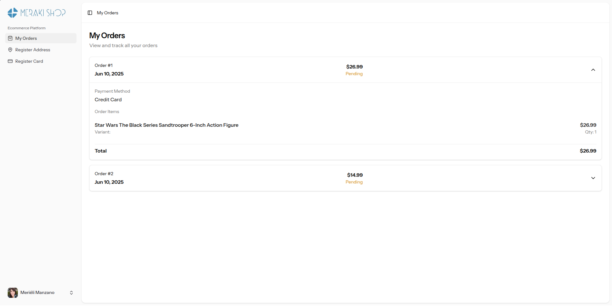
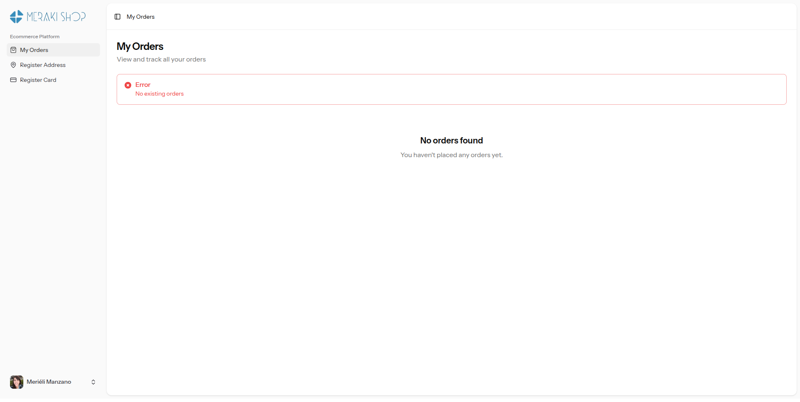
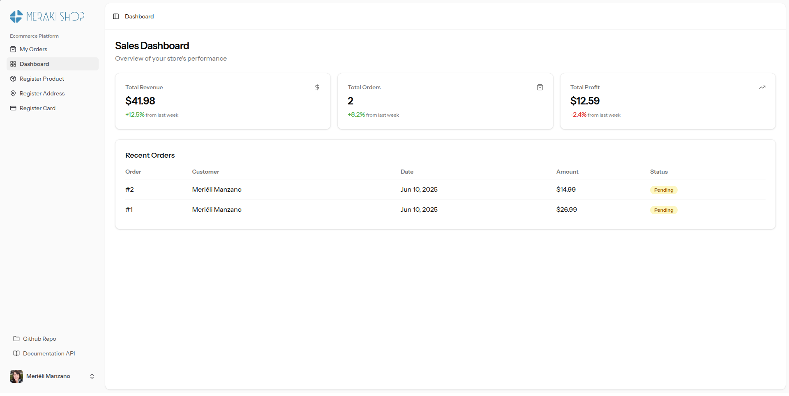
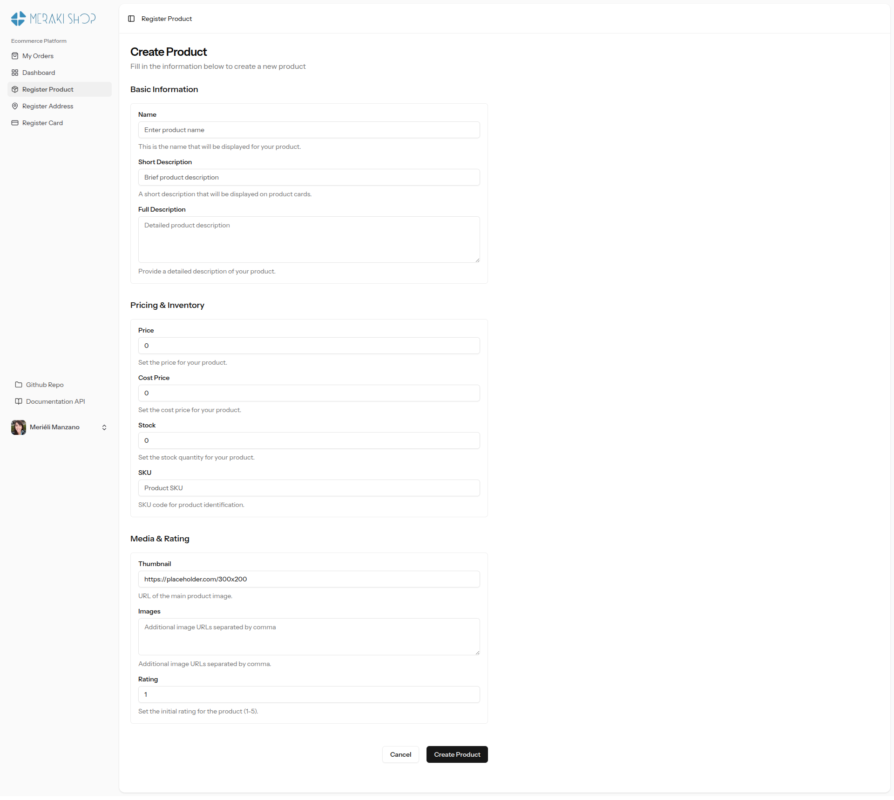
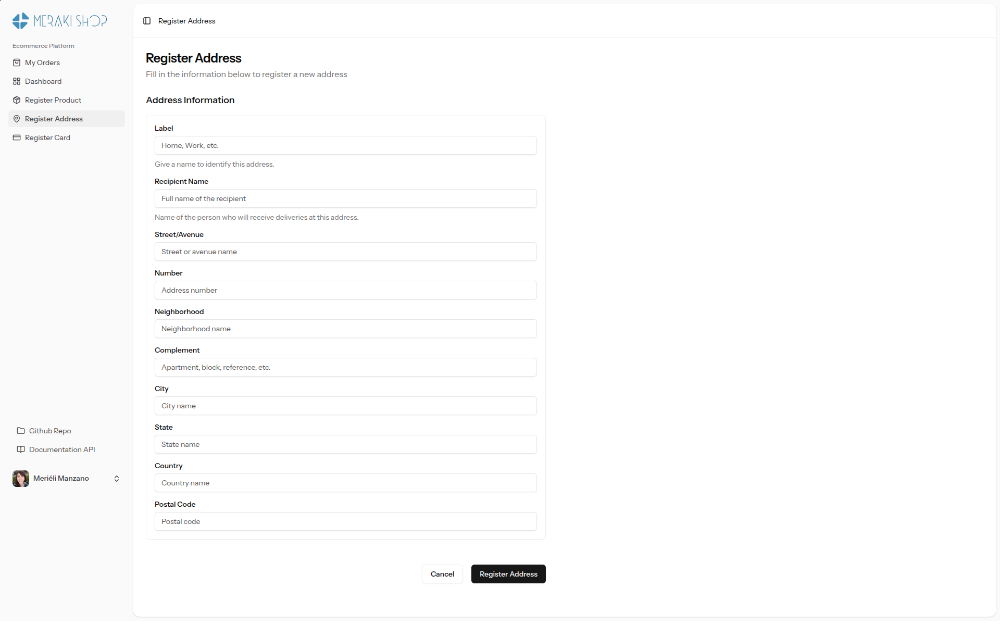
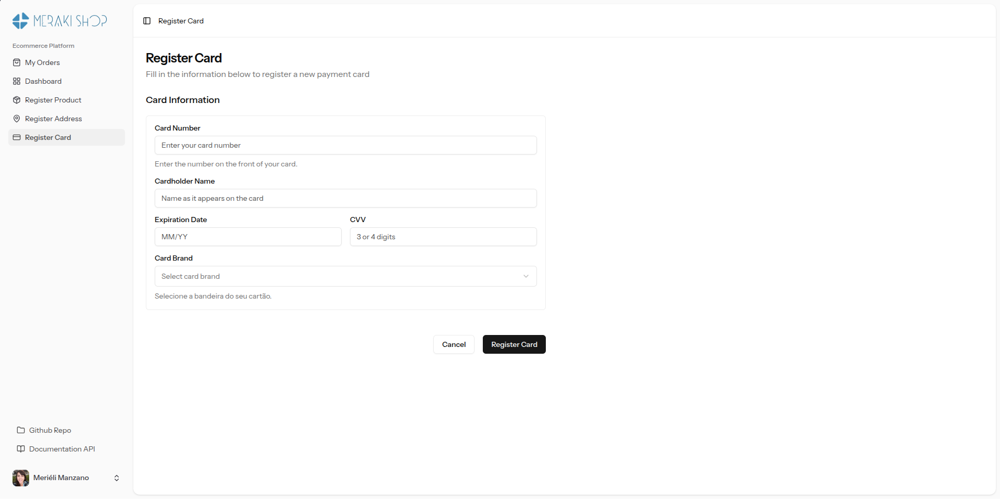
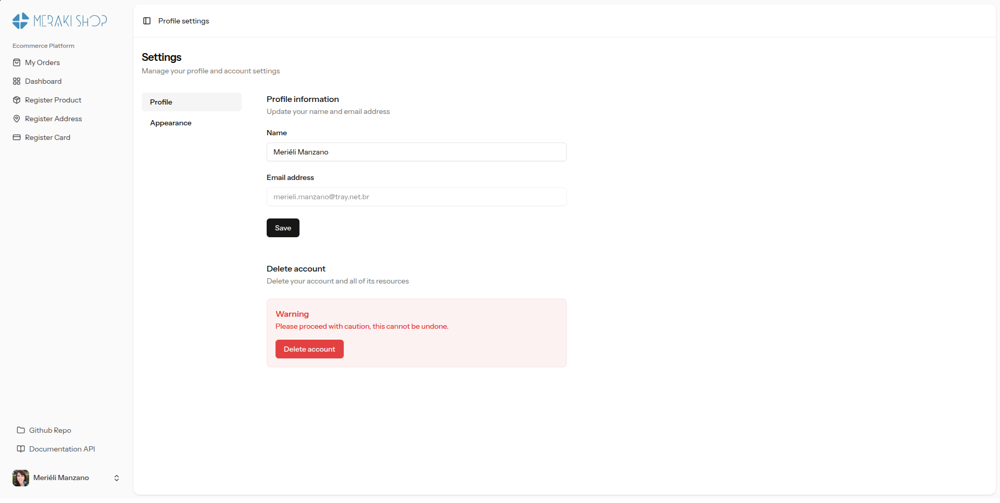
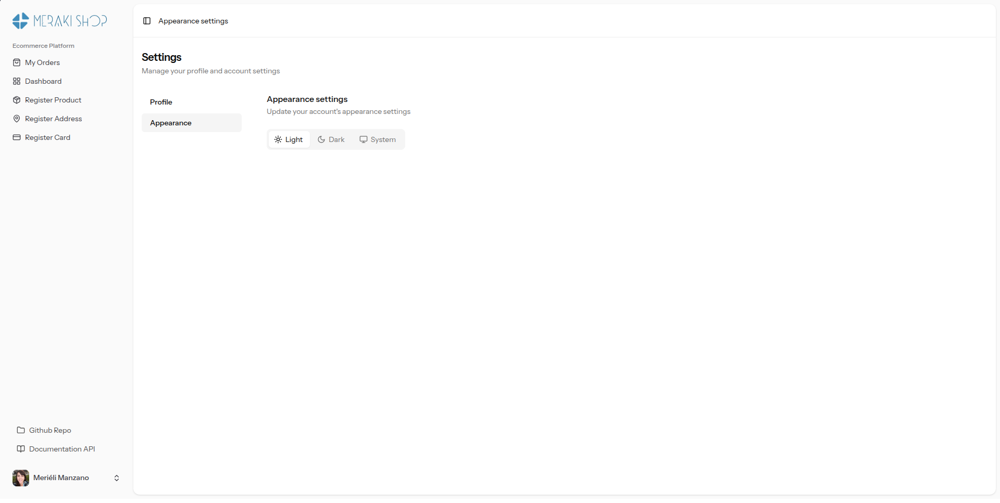

# 🛍️ Meraki Shop

<div style="display: flex; justify-content:center" >
    
</div>

## 📝 Descrição do Projeto

Meraki Shop é uma plataforma de e-commerce para colecionadores de figuras de ação, super-heróis e personagens de filmes e séries, com foco em colecionadores, com venda de peças únicas e limitadas, permitindo a compra de um boneco por vez, com entrega rápida e segura. A missão é oferecer um espaço seguro e exclusivo para que entusiastas possam encontrar e adquirir colecionáveis. O projeto foi desenvolvido com o objetivo de proporcionar uma experiência de compra fluida e segura, desde a visualização dos produtos até o gerenciamento de pedidos. Por ser um e-commerce com foco no mercado americano, toda a interface da aplicação está em inglês.

Com o propósito de agilizar a experiência de compra, a plataforma foi desenhada para ser direta e eficiente. O usuário pode finalizar a compra em um clique, desde que o endereço e cartão de crédito estejam cadastrados, sem a necessidade de longos cadastros ou processos complicados. Para maior conveniência, todos os preços exibidos já incluem o valor do frete, eliminando surpresas no checkout e garantindo transparência total.


## ✨ Funcionalidades

-   **Design Responsivo:** Interface adaptada para uma ótima experiência em desktops e dispositivos móveis.
-   **Tema Dark/Light:** Alterne entre os modos de visualização claro e escuro para maior conforto visual.

##### Para usuários em geral:

- **Visualização de Produtos:** Navegue por um catálogo de colecionáveis raros.
- **Autenticação de Usuário:** Sistema de login e registro para uma experiência personalizada.
- **Gerenciamento de Conta:** Usuários podem cadastrar e gerenciar seu endereço e cartão de crédito.
- **Histórico de Pedidos:** Acompanhe todos os seus pedidos na página "My Orders"

##### Exclusivo para usuários administradores:

- **Registro de Produtos:** Gerencie a criação de novos produtos para loja


## 🛠️ Stack de Tecnologias

O projeto é construído com uma stack moderna, aproveitando o poder do Laravel para o backend e a reatividade do Vue.js para o frontend.

-   **Backend:** [Laravel](https://laravel.com/) - Um framework PHP robusto e elegante, utilizado para construir toda a lógica de negócio e a API da aplicação.
-   **Frontend:** [Vue.js](https://vuejs.org/) - Integrado ao Laravel através de um starter kit, o Vue.js é responsável por criar uma interface de usuário interativa e dinâmica com o [TypeScript](https://www.typescriptlang.org/) para adicionar tipagem estática ao código do frontend, aumentando a segurança e a manutenibilidade.
-   **Banco de Dados:** [PostgreSQL](https://www.postgresql.org/) - Um sistema de banco de dados objeto-relacional de código aberto, escolhido por sua confiabilidade e robustez.
-   **Autenticação:** [WorkOS](https://workos.com/) - Serviço utilizado para gerenciar a autenticação de usuários de forma segura, incluindo login com provedores como o Google.


## 🖼️ Telas da Aplicação

Abaixo estão algumas telas que demonstram o fluxo da aplicação.

*Nota: Substitua os caminhos abaixo pelas imagens correspondentes da sua aplicação.*

### Página de Produtos

#### Usuário Não logado com Tema dark

<div style="display: flex; justify-content:center" >
    
</div>

#### Usuário Logado com Tema light 

<div style="display: flex; justify-content:center" >
    
</div>

> Nessa tela o usuário havia cadastrado apenas o cartão de crédito, por isso há um botão no topo para registro do endereço.

### Páginas do painel Administrativo

#### Meus pedidos

<div style="display: flex; justify-content:center" >
    
</div>

> Esta imagem é a visualização de um usuário comum no sistema para o seu histórico de pedidos.
> 
> Quando o usuário for do tipo cliente, ele verá algumas opções limitadas no sistema, disponíveis apenas para o controle e gerenciamento das suas compras na loja.

<div style="display: flex; justify-content:center" >
    
</div>

> Página sem pedidos

#### Painel administrativo visualização de administrador

<div style="display: flex; justify-content:center" >
    
</div>

> O administrador é o usuário que controla os produtos do ecommerce, por isso pode ver os além das funcionalidades comuns, o registro de produtos e o Dashboard, com métricas de vendas e os pedidos mais recentes realizados pelos clientes.


#### Cadastro de Produto

<div style="display: flex; justify-content:center" >
    
</div>


#### Cadastro de endereço

<div style="display: flex; justify-content:center" >
    
</div>


#### Cadastro de cartão de crédito

<div style="display: flex; justify-content:center" >
    
</div>

#### Configurações de conta

<div style="display: flex; justify-content:center" >
    
</div>

#### Configurações de Aparência da loja

<div style="display: flex; justify-content:center" >
    
</div>


## 🚀 Como Utilizar

1.  **Navegue pelos Produtos:** Na página inicial, você pode ver a lista de produtos disponíveis.
2.  **Faça Login ou Cadastre-se:** Para comprar, você precisa ter uma conta. Crie uma ou faça o login com uma conta Google.
3.  **Adicione seus Dados:** Antes da primeira compra, cadastre um endereço de entrega e um cartão de crédito através dos botões no topo da página.
4.  **Realize a Compra:** Com os dados cadastrados, basta clicar em "Buy with click" em um produto para finalizar o pedido.
5.  **Acompanhe seus Pedidos:** Na seção "My Orders", você pode visualizar o status e os detalhes de todas as suas compras.


## Estrutura de diretórios

A estrutura do projeto segue o padrão do Laravel, com o frontend em Vue.js integrado. Abaixo está uma representação da árvore de diretórios com as responsabilidades de cada parte:

```sh
meraki-shop/
├── .docs/ # Documentação Vitepress para organizar as demandas e o projeto
├── .images-cdn/ # Imagens a serem disponibilizadas via CDN Statically
├── .prints/ # Telas do sistema desenvolvido
├── app/  # Backend: Lógica principal da aplicação (PHP)
│   ├── Http/
│   │   └── Controllers/  # Backend: Controladores que lidam com as requisições
│   ├── Models/         # Backend: Modelos Eloquent para interação com o banco
│   ├── Services/       # Backend: Lógica de negócio da aplicação
│   └── ...
├── bootstrap/ # Backend: Scripts de inicialização do framework Laravel
├── config/ # Backend: Arquivos de configuração da aplicação
├── database/ # Banco de Dados: Migrations, seeders e factories
│   ├── migrations/   # Banco de Dados: Estrutura das tabelas
│   ├── seeders/      # Banco de Dados: População inicial
│   └── factories/    # Banco de Dados: Geração de dados de teste
├── public/ # Backend: Ponto de entrada público e assets compilados
├── resources/ # Frontend: Código-fonte da interface do usuário (Vue.js, CSS)
│   ├── css/          # Frontend: Estilos globais (app.css)
│   ├── js/           # Frontend: Código principal do Vue.js
│   │   ├── components/ # Frontend: Componentes reutilizáveis
│   │   ├── pages/      # Frontend: Páginas da aplicação
│   │   ├── layouts/    # Frontend: Estruturas de layout
│   │   └── ...
│   └── views/        # Frontend: Ponto de entrada do Laravel (app.blade.php)
├── routes/ # Backend: Definição de rotas da aplicação
│   ├── api.php       # Backend: Rotas da API
│   └── web.php       # Backend: Rotas web
├── storage/ # Backend: Arquivos gerados pelo framework (cache, logs)
├── tests/ # Testes: Testes automatizados da aplicação
└── ...     # Outros diretórios de configuração do Laravel
```

## 📖 Guia de Instalação

### ✅ Pré-requisitos

- Docker
- Docker Compose
- Git
- Conta no [WorkOS](https://workos.com/)

### 🏳️ Configuração e Desenvolvimento com Docker

1.  Clone o repositório e entre no diretório:

```sh
git clone <repository-url>
cd meraki-shop
```

2.  Copie o arquivo de ambiente:

```sh
cp .env.example .env
```

> 💡 Prepare as chaves necessárias para o projeto:
> - Todas que começam com `WORKOS`, depois `DB_PASSWORD` e `DB_USERNAME` que devem ser o usuário da sua máquina.

3.  Inicie uma sessão interativa do Docker para configurar o projeto:

```sh
docker compose build
docker compose up -d
docker exec -it meraki-shop-dev-php-fpm sh
```

4.  Dentro do contêiner Docker, instale as dependências e configure o projeto:

```sh
# Instale as dependências do PHP
cmp install

# Instale as dependências do Node.js
npm install

# Gere o manifesto do Vite
npm run build

# Gere a chave da aplicação
php artisan key:generate

# Execute as migrações já provendo alguns produtos pré inseridos no sistema
php artisan migrate --seed
```


### 🛠️ Comandos Comuns de Desenvolvimento

Estes são os comandos padrão usados no desenvolvimento:

**📦 Gerenciamento de Pacotes**
```sh
# Dependências do PHP
composer install

# Dependências do Node.js
npm install

# Compile as dependências para gerar o manifesto
npm run build
```

**🖥️ Desenvolvimento**
```sh
# O comando `cmp` é um alias disponibilizado via docker para `composer`
# Inicia o servidor de desenvolvimento do Laravel, o ouvinte da fila, o observador de logs e o Vite
cmp dev

# Inicia o servidor de desenvolvimento da documentação
npm run docs:dev
```

**🧹 Qualidade de Código**
```sh
# Formata o código PHP
cmp lint:pint

# Executa a análise do PHPStan
cmp check

# Executa todas as validações
cmp valid

# Formata o código do frontend
npm run format
```

**🧪 Testes**
```sh
cmp test
```

### Acessando a Aplicação

-   🏠 Aplicação principal: http://localhost:8000
-   📖 Documentação da API: http://localhost:8000/docs/api
-   📚 Documentação do Projeto no Vitepress: http://localhost:5175
