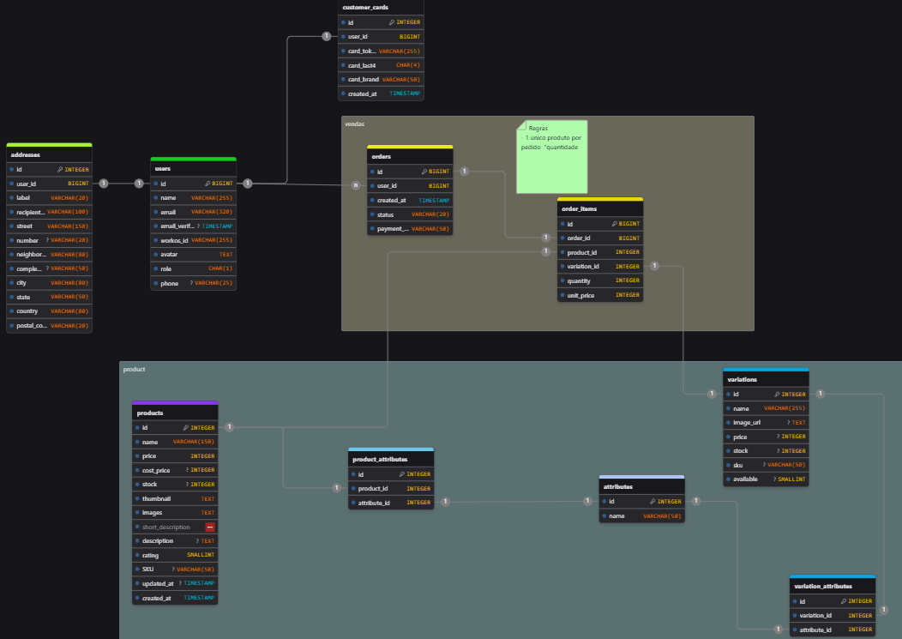
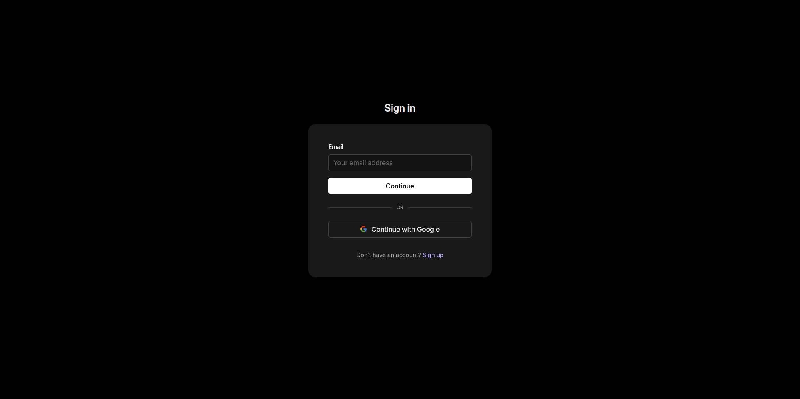
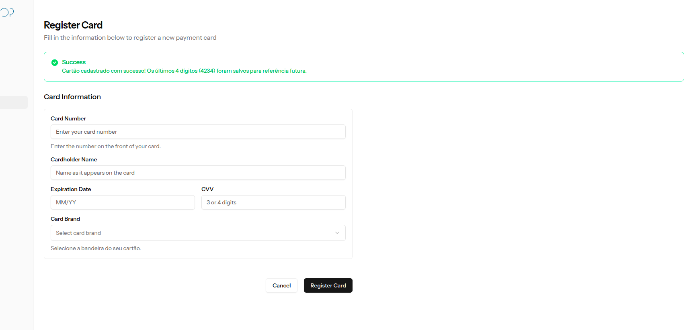
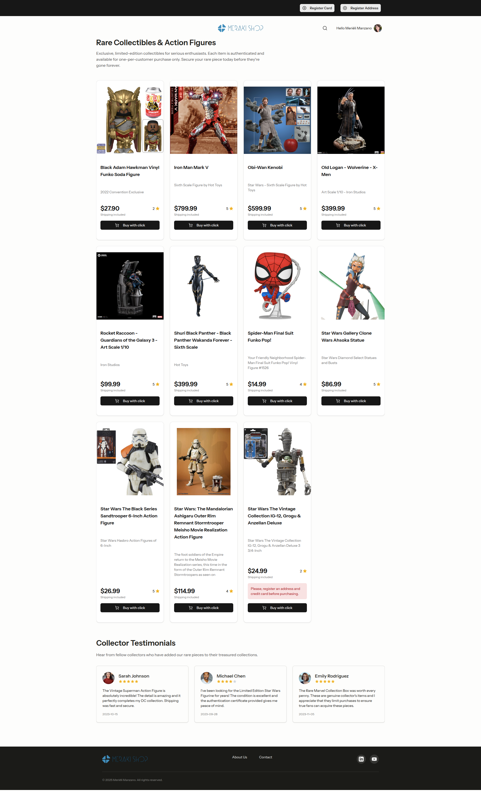
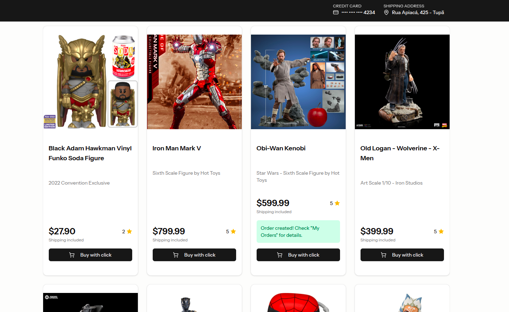

# 🛍️ Meraki Shop

## 🔭 Visão do Sistema

A plataforma Meraki Shop é um e-commerce especializado para colecionadores, construído com uma arquitetura moderna que separa o backend do frontend, garantindo escalabilidade e manutenibilidade. Por ser um e-commerce com foco no mercado americano, toda a interface da aplicação está em inglês.

Com o propósito de agilizar a experiência de compra, a plataforma foi desenhada para ser direta e eficiente. O usuário pode finalizar a compra em um clique, desde que o endereço e cartão de crédito estejam cadastrados, sem a necessidade de longos cadastros ou processos complicados. Para maior conveniência, todos os preços exibidos já incluem o valor do frete, eliminando surpresas no checkout e garantindo transparência total.

O fluxo do usuário é projetado para ser simples e direto: após o cadastro e login (facilitado pelo WorkOS), o cliente pode salvar seu endereço e cartão de crédito para habilitar a funcionalidade de "compra com um clique", agilizando o processo de aquisição de itens colecionáveis. O sistema também diferencia usuários comuns de administradores, onde estes últimos possuem acesso a funcionalidades de gerenciamento de produtos e a um dashboard com métricas de vendas.


## 🏗️ Arquitetura da Aplicação

O projeto adota o padrão arquitetural **Model-View-Controller (MVC)** no backend com Laravel, complementado por um frontend desacoplado em Vue.js. Essa abordagem organiza o código de forma clara e eficiente.

-   **Model:** Representa a estrutura de dados e a lógica de negócio. Em Laravel, são as classes Eloquent localizadas em `app/Models/`. Elas são responsáveis por interagir com as tabelas do banco de dados. Por exemplo, o modelo `Product` gerencia os dados na tabela `products`.

-   **View:** Camada responsável pela apresentação da interface do usuário. Neste projeto, a abordagem é híbrida. O Laravel serve uma view principal (`resources/views/app.blade.php`), que atua como um contêiner para a aplicação frontend. A renderização da interface e a interatividade são totalmente gerenciadas pelo Vue.js, cujos componentes e páginas estão em `resources/js/`.

-   **Controller:** Atua como o intermediário entre o Model e a View. Localizados em `app/Http/Controllers/`, os controladores recebem as requisições HTTP (enviadas pelo frontend Vue), utilizam os Models para consultar ou manipular dados e retornam uma resposta. Em vez de retornar uma view HTML completa, eles geralmente devolvem dados em formato JSON, que são consumidos pela aplicação Vue para atualizar a interface.

Essa arquitetura, conhecida como "headless" ou API-driven, permite que o backend e o frontend sejam desenvolvidos e mantidos de forma independente, oferecendo maior flexibilidade e uma experiência de usuário mais fluida.


## ✨ Funcionalidades

-   **Design Responsivo:** Interface adaptada para uma ótima experiência em desktops e dispositivos móveis.
-   **Tema Dark/Light:** Alterne entre os modos de visualização claro e escuro para maior conforto visual.

##### Para usuários em geral:

- **Visualização de Produtos:** Navegue por um catálogo de colecionáveis raros.
- **Autenticação de Usuário:** Sistema de login e registro para uma experiência personalizada.
- **Gerenciamento de Conta:** Usuários podem cadastrar e gerenciar seu endereço e cartão de crédito.
- **Histórico de Pedidos:** Acompanhe todos os seus pedidos na página "My Orders"

##### Exclusivo para usuários administradores:

- **Registro de Produtos:** Gerencie a criação de novos produtos para loja


## Diagrama ER do banco de dados

Este projeto foi estruturado com um banco de dados relacional, utilizando o PostgreSQL. Abaixo está o diagrama entidade-relacionamento (ER) que ilustra as principais entidades e seus relacionamentos.

<div style="display: flex; justify-content:center" >
    
</div>

Apesar do banco de dados comportar produtos com variação, a ideia inicial desse MVP é de que cada produto seja único, ou seja, não há variações de tamanho ou cor. Cada produto é representado por uma única entrada na tabela `products`, e o relacionamento com as tabelas `orders` e `order_items` permite que cada pedido contenha apenas um item por vez, reforçando a ideia de exclusividade e raridade dos produtos oferecidos. No futuro o sistema poderá ser expandido para suportar variações de produtos sem grandes mudanças na estrutura do banco de dados, mantendo a flexibilidade e escalabilidade da aplicação.


## 🖼️ Telas da Aplicação

Abaixo estão algumas telas que demonstram o fluxo da aplicação.

### Página de Produtos

#### Usuário Não logado com Tema dark

<div style="display: flex; justify-content:center" >
    
</div>

#### Usuário Logado com Tema light 

<div style="display: flex; justify-content:center" >
    
</div>

> Nessa tela o usuário havia cadastrado apenas o cartão de crédito, por isso há um botão no topo para registro do endereço.


### Página de Login

<div style="display: flex; justify-content:center" >
    
</div>


### Páginas do painel Administrativo

#### Meus pedidos

<div style="display: flex; justify-content:center" >
    
</div>

> Esta imagem é a visualização de um usuário comum no sistema para o seu histórico de pedidos.
> 
> Quando o usuário for do tipo cliente, ele verá algumas opções limitadas no sistema, disponíveis apenas para o controle e gerenciamento das suas compras na loja.

<div style="display: flex; justify-content:center" >
    
</div>

> Página sem pedidos

#### Painel administrativo visualização de administrador

<div style="display: flex; justify-content:center" >
    
</div>

> O administrador é o usuário que controla os produtos do ecommerce, por isso pode ver os além das funcionalidades comuns, o registro de produtos e o Dashboard, com métricas de vendas e os pedidos mais recentes realizados pelos clientes.


#### Cadastro de Produto

<div style="display: flex; justify-content:center" >
    
</div>


#### Cadastro de endereço

<div style="display: flex; justify-content:center" >
    
</div>


#### Cadastro de cartão de crédito

<div style="display: flex; justify-content:center" >
    
</div>

#### Configurações de conta

<div style="display: flex; justify-content:center" >
    
</div>

#### Configurações de Aparência da loja

<div style="display: flex; justify-content:center" >
    
</div>


#### Registro de cartão de crédito com sucesso 

<div style="display: flex; justify-content:center" >
    
</div>


#### Tentativa de compra do produto 

<div style="display: flex; justify-content:center" >
    
</div>

> Erro que é exibido ao tentar comprar sem um endereço e cartão de crédito cadastrados


<div style="display: flex; justify-content:center" >
    
</div>

> Compra do produto com sucesso quando todos os dados estão corretos

## 🚀 Como Utilizar

1.  **Navegue pelos Produtos:** Na página inicial, você pode ver a lista de produtos disponíveis.
2.  **Faça Login ou Cadastre-se:** Para comprar, você precisa ter uma conta. Crie uma ou faça o login com uma conta Google.
3.  **Adicione seus Dados:** Antes da primeira compra, cadastre um endereço de entrega e um cartão de crédito através dos botões no topo da página.
4.  **Realize a Compra:** Com os dados cadastrados, basta clicar em "Buy with click" em um produto para finalizar o pedido.
5.  **Acompanhe seus Pedidos:** Na seção "My Orders", você pode visualizar o status e os detalhes de todas as suas compras.


## Estrutura de diretórios

A estrutura do projeto segue o padrão do Laravel, com o frontend em Vue.js integrado. Abaixo está uma representação da árvore de diretórios com as responsabilidades de cada parte:

```sh
meraki-shop/
├── .docs/ # Documentação Vitepress para organizar as demandas e o projeto
├── .images-cdn/ # Imagens a serem disponibilizadas via CDN Statically
├── .prints/ # Telas do sistema desenvolvido
├── app/  # Backend: Lógica principal da aplicação (PHP)
│   ├── Http/
│   │   └── Controllers/  # Backend: Controladores que lidam com as requisições
│   ├── Models/         # Backend: Modelos Eloquent para interação com o banco
│   ├── Services/       # Backend: Lógica de negócio da aplicação
│   └── ...
├── bootstrap/ # Backend: Scripts de inicialização do framework Laravel
├── config/ # Backend: Arquivos de configuração da aplicação
├── database/ # Banco de Dados: Migrations, seeders e factories
│   ├── migrations/   # Banco de Dados: Estrutura das tabelas
│   ├── seeders/      # Banco de Dados: População inicial
│   └── factories/    # Banco de Dados: Geração de dados de teste
├── public/ # Backend: Ponto de entrada público e assets compilados
├── resources/ # Frontend: Código-fonte da interface do usuário (Vue.js, CSS)
│   ├── css/          # Frontend: Estilos globais (app.css)
│   ├── js/           # Frontend: Código principal do Vue.js
│   │   ├── components/ # Frontend: Componentes reutilizáveis
│   │   ├── pages/      # Frontend: Páginas da aplicação
│   │   ├── layouts/    # Frontend: Estruturas de layout
│   │   └── ...
│   └── views/        # Frontend: Ponto de entrada do Laravel (app.blade.php)
├── routes/ # Backend: Definição de rotas da aplicação
│   ├── api.php       # Backend: Rotas da API
│   └── web.php       # Backend: Rotas web
├── storage/ # Backend: Arquivos gerados pelo framework (cache, logs)
├── tests/ # Testes: Testes automatizados da aplicação
└── ...     # Outros diretórios de configuração do Laravel
```
